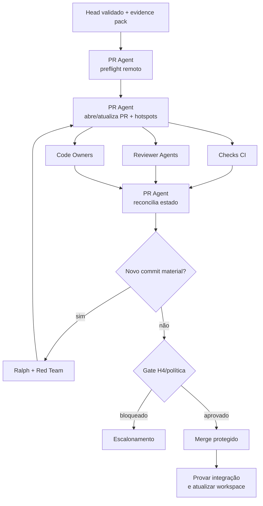

# Workflow 06 — PR e merge

> Bloco executável do [🚪 Gatekeeper Loop](../docs/loops/06-pr-and-merge.md): transforma um baseline validado em proposta de integração auditável e prova que somente o head aprovado chegou à branch protegida.

A PR é interface de decisão, não uma segunda implementação ou um dump do evidence pack. Ela destaca comportamento, hotspots, risco, evidências, exceções e rollback para que Code Owners decidam H4 sem reconstruir o trabalho anterior.

---

## Resultado do bloco

Uma execução fechada liga Work Item, commits, PR, checks, reviews, decisão H4 e resultado de merge. O head validado, o head aprovado e o head integrado precisam formar uma cadeia comprovável; estado remoto atual sempre prevalece sobre memória ou snapshot local.

| Camada | Condição de fechamento |
|---|---|
| **Loop** | base atualizada, CI exigido verde, aprovações válidas e exceções resolvidas |
| **Agentes** | PR Agent sintetizou/roteou; reviewers e Code Owners mantiveram autoridade independente |
| **Plataforma** | branch protection/ruleset foi consultado e o merge ocorreu apenas pela política |
| **Workspace** | Work Item, review interno, `STATUS.md` e board refletem o estado remoto |
| **Prova** | commit integrado é descendente/head esperado na branch destino ou o bloqueio está explícito |

---

## Contrato operacional

| Contrato | Definição |
|---|---|
| **Etapa** | 6 — construção e validação |
| **Unidade de execução** | uma PR por conjunto coerente de Work Items e baseline validado |
| **Consolida** | [PR Agent](../agents/pr-agent/AGENT.md) |
| **Colaboram** | Reviewer Agents e Code Owners exigidos pelos paths, risco e política |
| **Owner humano** | Code Owner ou Tech Lead conforme branch protection e classe de risco |
| **Entrada** | commits/diff validados, evidence pack Red Team, checks, risco, base/head e autorização de publicação |
| **Saída** | PR rastreável, review/decisão H4 e merge comprovado ou bloqueio reproduzível |
| **Gate de conteúdo** | descrição, critérios, hotspots, risco, checks, rollback, fora de escopo e links completos |
| **Gate de integração** | head atual validado; CI verde; base atualizada; approvals válidos; nenhuma exceção pendente |
| **Volta dominante** | externa — ajuste volta ao Ralph Loop e revalida no Red Team |
| **Próximo workflow** | [07 — homologação](07-release-candidate-validation.md), após merge comprovado |

---

## Preflight remoto

1. Resolver Work Item, repositório, branch/base, commits e evidence pack; confirmar autorização para abrir/atualizar PR.
2. Consultar estado remoto atual: branch destino, head publicado, PR existente, checks, reviews, conflitos e ruleset.
3. Provar que o `head_commit` da PR é o mesmo validado pelo Red Team. Divergência bloqueia a abertura como “pronta”.
4. Identificar Code Owners dos paths, approvals por risco, lanes CI e política de merge/auto-merge.
5. Detectar PR duplicada para branch/Work Item antes de criar outra.
6. Confirmar plano de rollback, migrations/ordem de deploy e arquivos sensíveis.
7. Registrar no Work Item a transição para `review` e o identificador da PR somente após a plataforma confirmar a operação.

### Envelope de abertura

```yaml
mission_id: "GATEKEEPER-<id>"
work_item_id: "<WI-id>"
workflow: "06-pr-and-merge"
repository: "<repo-id>"
base_branch: "<base>"
head_branch: "<head>"
validated_head: "<sha>"
validation_run_id: "<REDTEAM-id>"
risk: "<classe>"
required_checks: []
required_approvals: []
code_owners: []
permissions:
  open_or_update_pr: false
  enable_auto_merge: false
  merge: false
stop_conditions: []
```

---

## Plano de missões



| Missão | Responsável | Saída |
|---|---|---|
| M1 — reconciliar baseline | PR Agent | base/head/validation run e política atuais |
| M2 — publicar síntese | PR Agent | título, comportamento, riscos, hotspots, evidências, rollback e fora de escopo |
| M3 — verificar | CI e Reviewer Agents | checks e comentários no head atual |
| M4 — decidir | Code Owners/Tech Lead | H4 ou resultado automático permitido pela política |
| M5 — integrar | plataforma/ator autorizado | merge conforme estratégia protegida |
| M6 — comprovar | PR Agent | PR/commit/branch destino e workspace reconciliados |

Checks e reviews podem ocorrer em paralelo, mas sua validade é indexada pelo `head_sha`. Qualquer novo commit abre uma nova revisão de validade antes do gate.

---

## Contrato da descrição da PR

A descrição sintetiza:

1. problema e comportamento alterado;
2. Work Items, PRD/UX/SPEC e baseline validado;
3. critérios de aceite e link para evidência correspondente;
4. hotspots: paths/trechos que concentram risco e por quê;
5. testes/checks executados, sem colar logs extensos;
6. impacto em dados, contratos, segurança, observabilidade e operação;
7. rollout/rollback e ordem de integração quando houver;
8. fora de escopo, riscos residuais e exceções com prazo;
9. owners solicitados e decisão H4 requerida.

Se o reviewer precisa reler todas as sessões ou repetir o Red Team, a síntese falhou. Se não consegue chegar ao resultado bruto por link, ela esconde evidência.

---

## Invalidação por novo head

| Mudança após review | O que invalida |
|---|---|
| formatação comprovadamente sem comportamento | somente checks definidos pela política; justificativa registrada |
| código/teste/configuração | approvals e evidências dos paths/comportamentos afetados |
| dependência, contrato, schema ou migração | Security/Architecture/QA/CI correspondentes e possivelmente H3/H4 |
| escopo/outcome/UX | retorna ao Studio/Drafting, não é absorvido na PR |
| rebase/merge da base com diferença material | checks/revalidação definidos pelo harness |

O PR Agent calcula impacto e roteia; não preserva approval por conveniência.

---

## Fronteiras de autoridade

| Participante | Faz | Não faz |
|---|---|---|
| PR Agent | abre/atualiza PR autorizada, sintetiza, consulta remoto, solicita owners e reconcilia | implementa correção, aprova própria PR, declara CI pela memória ou faz merge sem política |
| Reviewer Agent | revisa o recorte do contrato no head atual | substitui Code Owner ou altera código silenciosamente |
| Code Owner/Tech Lead | decide H4 conforme risco/política | tem aprovação inferida por ausência de resposta |
| plataforma | aplica checks, ruleset e estratégia de merge | tem resultado reinterpretado pelo agente sem consulta atual |

Identidades de autor e aprovador permanecem distintas e são impostas pela plataforma, não apenas por prompt.

---

## Skills e contexto mínimo

| Participante | Skills prioritárias |
|---|---|
| PR Agent | `check-pr`, `update-pr`, `commit`, `dev-flow` |
| agentes operando workspace | `workspace-memory`, `workspace-projects`, `workspace-board` conforme operação |
| reviewer técnico acionado | skills de review do próprio contrato, já registradas no Red Team |

Cada envelope registra `skills_used`. O PR Agent recebe evidence pack consolidado e hotspots; não recebe memória privada ou logs integrais sem necessidade.

---

## Persistência e prova de integração

| Artefato | Destino | Regra |
|---|---|---|
| PR, checks, approvals e merge | plataforma de código | fonte atual do estado remoto |
| Work Item | `work-items/<WI-id>.md` | link, base/head, status e decisão |
| review interno | `execution/reviews/pr-<WI-id>.md` | comentários materiais, resoluções, H4 e prova de merge |
| evidence pack | fonte existente do Red Team, referenciada | não duplicar na descrição |
| exceção pendente | `.coordination/blockers/` até promoção formal | prazo, owner e compensação |
| `STATUS.md` e `BOARD.md` | workspace Tech Lead | atualizados após confirmação remota |

Depois do merge, registrar: PR, estratégia, commit resultante, branch destino observada, timestamp e prova de ancestralidade/contém. A ação só é concluída quando a plataforma confirma; solicitação enviada não equivale a merge.

---

## Gates

### Gate da PR

- [ ] PR referencia Work Item e artefatos vigentes;
- [ ] `head_sha` corresponde ao baseline validado;
- [ ] descrição apresenta comportamento, critérios, hotspots, risco, evidência, rollback e fora de escopo;
- [ ] base está atualizada conforme política e não há conflito;
- [ ] checks exigidos estão verdes no head atual;
- [ ] approvals/Code Owners exigidos estão válidos;
- [ ] nenhuma exceção pendente ou finding aberto foi ocultado.

### Gate de execução em bloco

- [ ] estado remoto foi consultado imediatamente antes da decisão;
- [ ] novo commit invalidou e reabriu checks/reviews correspondentes;
- [ ] H4/auto-merge obedecem à classe de risco e autonomia vigentes;
- [ ] ausência de resposta não foi contada como approval;
- [ ] merge foi executado por ator/política autorizados e comprovado;
- [ ] Work Item, review, `STATUS.md` e board refletem o resultado remoto.

---

## Falhas e escalonamento

| Condição | Destino |
|---|---|
| comentário exige código | Ralph Loop + revalidação Red Team |
| comentário revela escopo/UX incorreto | Studio Loop |
| comentário revela decisão arquitetural | Drafting Loop/H3 |
| aprovação exigida indisponível | `blocked`; owner define substituição/prazo conforme política |
| CI inconsistente ou não reproduzível | escalar com runs, commits e ambientes; retry cego não aprova |
| conflito entre reviewers | Code Owner/Tech Lead decide com divergência explícita |
| exceção de política | owner autorizado, com prazo e compensação |
| branch divergiu ou head remoto mudou | interromper e refazer preflight |

---

## Envelope final

```yaml
mission_id: "GATEKEEPER-<id>"
work_item_id: "<WI-id>"
workflow: "06-pr-and-merge"
status: completed | partial | blocked
transition: merged_ready_for_rc | returned_for_rework | awaiting_h4 | escalated
repository: "<repo-id>"
pull_request: "<url-or-id>"
base_branch: "<base>"
validated_head: "<sha>"
approved_head: "<sha>"
merge_commit: "<sha-or-null>"
remote_state_checked_at: "<timestamp>"
skills_used: []
checks: []
approvals: []
exceptions: []
outputs_created: []
decisions_recorded: []
gates:
  passed: []
  failed: []
  not_run: []
handoff_to: []
```

`merged_ready_for_rc` exige prova remota do merge do head aprovado; PR “mergeable” ou comando bem-sucedido não basta.
