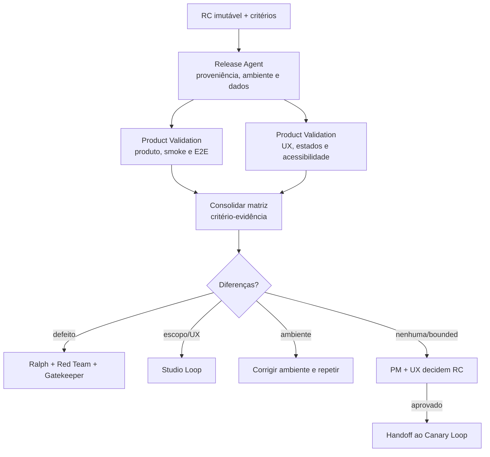

# Workflow 07 — homologação do release candidate

> Bloco executável do [🎭 Rehearsal Loop](../docs/loops/07-release-candidate-validation.md): prova em ambiente representativo que o artefato integrado entrega o comportamento de produto e experiência aprovado.

Homologação não repete code review. Ela compara promessa e realidade usando o mesmo artefato imutável que pode chegar à produção. Release Agent prepara e comprova o ambiente; Product Validation Agent consolida a matriz de aceite; PM e UX mantêm a decisão humana.

---

## Resultado do bloco

Uma execução fechada identifica exatamente o release candidate, ambiente, dados, critérios e evidências. Cada diferença é classificada como defeito, gap de escopo/experiência, limitação de ambiente ou risco aceito; nenhuma ausência vira aprovação informal.

| Camada | Condição de fechamento |
|---|---|
| **Loop** | critérios de produto/UX executados em ambiente representativo |
| **Agentes** | Release provou proveniência/ambiente; Product Validation consolidou sem dar aceite humano |
| **Workspaces** | PM, UX e Tech Lead persistiram evidências nos próprios domínios, ligados pelo RC/Work Item |
| **Artefato** | digest/versão homologada é a mesma promovível a produção; não houve rebuild |
| **Decisão** | owners aceitaram RC ou registraram retorno/pendência com owner e prazo |

---

## Contrato operacional

| Contrato | Definição |
|---|---|
| **Etapa** | 7 — release e operação |
| **Unidade de execução** | um release candidate imutável identificado por `release_candidate_id` e digest |
| **Consolida** | [Product Validation Agent](../agents/product-validation-agent/AGENT.md) |
| **Prepara ambiente** | [Release Agent](../agents/release-agent/AGENT.md) |
| **Owners humanos** | PM para valor; UX para experiência; stakeholder apenas quando definido no critério |
| **Entrada** | artefato integrado, PRD, UX spec, critérios, ambiente, dados seguros, risco e evidências técnicas |
| **Saída** | relatório/matriz de homologação, evidências de ambiente, demo e RC aprovado/devolvido |
| **Gate de conteúdo** | cada critério validado ou classificado com plano explícito; diferenças e limitações registradas |
| **Gate do bloco** | conteúdo + proveniência imutável + ambiente/dados comprovados + estado multiworkspace + decisão humana |
| **Volta dominante** | externa — defeito volta ao Ralph; gap de escopo/UX volta ao Studio |
| **Próximo workflow** | [08 — produção e observação](08-production-release-and-observation.md) |

---

## Preflight do release candidate

1. Resolver Work Item, PR/merge, release candidate, versão/digest, origem e assinatura quando aplicável.
2. Provar que o candidato foi produzido do commit integrado e que o mecanismo de promoção não exige rebuild.
3. Resolver PRD e UX spec aprovados, critérios e revisões usadas no Gatekeeper.
4. Preparar manifest do ambiente: versão, configuração relevante, dependências, flags, migrações e diferenças conhecidas em relação à produção.
5. Provisionar dados sintéticos/anonimizados e permissões seguras; dados reais sensíveis não são copiados por conveniência.
6. Definir matriz de execução, owners e condição de parada; ambiente ou critério insuficiente bloqueia antes do “aceite”.
7. Criar `mission_id` comum e pastas de evidência nos três workspaces.

### Envelope de abertura

```yaml
mission_id: "REHEARSAL-<id>"
work_item_id: "<WI-id>"
workflow: "07-release-candidate-validation"
release_candidate:
  id: "<RC-id>"
  version: "<version>"
  digest: "<digest>"
  source_commit: "<sha>"
environment:
  id: "<preview-or-staging>"
  manifest: "<path>"
criteria:
  product: []
  ux: []
risk: "<classe>"
permissions: []
stop_conditions: []
```

---

## Plano de missões



| Missão | Responsável | Saída |
|---|---|---|
| M1 — preparar RC | Release Agent | prova de proveniência, manifest de ambiente, dados e smoke de deploy |
| M2 — validar produto | Product Validation Agent | outcome, requisitos, smoke/E2E e diferenças funcionais |
| M3 — validar experiência | Product Validation Agent, consultando UX | fluxos, estados, conteúdo, acessibilidade e comparação visual quando aplicável |
| M4 — consolidar | Product Validation Agent | matriz critério-evidência e classificação de diferenças |
| M5 — demonstrar | Release + Product Validation | demo/gravação proporcional, sem substituir evidência |
| M6 — decidir | PM e UX humanos | aprovar RC, devolver, aceitar pendência autorizada ou encerrar |

M2 e M3 podem rodar em paralelo contra o mesmo RC/manifest, mas escrevem relatórios por domínio. A matriz consolidada referencia ambos e nunca escolhe silenciosamente entre critérios conflitantes.

---

## Proveniência e representatividade

O gate verifica duas propriedades diferentes:

| Propriedade | Prova mínima |
|---|---|
| **imutabilidade** | digest, source commit e registro de build/promoção ligam merge → RC → futuro release |
| **representatividade** | diferenças de config, dados, serviços, flags, migrações e escala estão enumeradas e avaliadas |

Um ambiente pode ser representativo sem ser idêntico; a diferença precisa ser conhecida e não invalidar o critério testado. Artefato reconstruído, “equivalente” por descrição ou sem digest não passa.

---

## Classificação de diferenças

| Classe | Exemplo | Retorno |
|---|---|---|
| defeito de implementação | comportamento viola SPEC/critério aprovado | Ralph → Red Team → Gatekeeper → novo RC |
| gap de produto | comportamento esperado nunca foi definido | Studio Loop / PM |
| gap de experiência | estado, conteúdo ou recuperação ausente no baseline | Studio Loop / UX |
| limitação de ambiente | integração/dado/config impede prova | Release Agent corrige ambiente; repetir somente critérios afetados |
| risco residual conhecido | diferença aceita dentro de autoridade | decisão formal com owner, prazo e observação em produção |

Product Validation recomenda; não altera código, requisito ou UX para “fazer passar”.

---

## Skills e contexto mínimo

| Agente | Skills prioritárias |
|---|---|
| todos | `workspace-memory`, `workspace-projects`, `workspace-board` conforme operação |
| Product Validation | `review-prd`, `review-cross-prd-spec`, `update-docs` |
| Release Agent | `check-pr`, `update-pr`, `dev-flow`, `update-docs` |

Cada envelope registra `skills_used`. Product Validation recebe RC, critérios e links; Release recebe proveniência, ambiente e estratégia. Dados sensíveis e memória privada não atravessam workspaces.

---

## Persistência multiworkspace

| Artefato | Fonte canônica | Writer |
|---|---|---|
| matriz e recomendação de produto | `<pm-workspace>/projects/<project>/validation/<WI-id>.md` | Product Validation Agent |
| validação de UX | `<ux-workspace>/projects/<project>/validation/<WI-id>.md` | Product Validation Agent no domínio UX |
| manifest/evidências do ambiente | `<tech-lead-workspace>/projects/<project>/execution/evidence/<WI-id>/release-candidate/` | Release Agent |
| demo/gravação | `<pm-workspace>/projects/<project>/validation/assets/<RC-id>/` | Product Validation/Release |
| decisões dos owners | fontes de decisão de PM/UX ligadas à matriz | owner correspondente |
| handoff de release | `.coordination/handoffs/` até promoção | Release Agent; aponta para RC e fontes |

Fechamento: persistir evidência técnica/UX → consolidar matriz PM → registrar decisões → atualizar Work Items/`STATUS.md` em cada domínio → reconciliar boards → promover handoff ao release.

---

## Gates

### Gate do RC

- [ ] versão/digest/source commit do RC são verificáveis e promovíveis sem rebuild;
- [ ] ambiente e diferenças para produção estão documentados;
- [ ] dados de teste são seguros e suficientes;
- [ ] cada critério de PRD e UX possui procedimento, resultado e evidência;
- [ ] estados de sucesso, falha, recuperação e acessibilidade aplicáveis foram exercitados;
- [ ] diferenças foram classificadas e não escondidas por demo favorável.

### Gate de execução em bloco

- [ ] Release e Product Validation preservaram seus limites;
- [ ] PM/UX/Tech Lead persistiram apenas nos domínios correspondentes;
- [ ] novo RC invalidou resultados do candidato anterior;
- [ ] pendência aceita possui owner, prazo, risco e plano de observação;
- [ ] Work Items, matrizes, evidências, status e boards estão coerentes;
- [ ] aprovação humana referencia o RC/digest exato.

---

## Retornos e escalonamento

| Condição | Estado/destino |
|---|---|
| ambiente/dados insuficientes | `blocked`; Release/owner corrige pré-condição |
| critério ausente ou comportamento indefinido | Studio Loop; aprovação informal proibida |
| defeito reproduzível | Ralph Loop com cenário, impacto e evidência |
| experiência divergente | UX decide correção de baseline ou implementação |
| mudança de escopo | PM decide e H2 relacionado é reaberto |
| stakeholder discorda sem critério | registrar feedback; PM/UX decidem se altera baseline |

---

## Envelope final

```yaml
mission_id: "REHEARSAL-<id>"
work_item_id: "<WI-id>"
workflow: "07-release-candidate-validation"
status: completed | partial | blocked
transition: approved_for_release | returned_to_implementation | returned_to_planning | environment_blocked
release_candidate:
  id: "<RC-id>"
  digest: "<digest>"
  source_commit: "<sha>"
environment_manifest: "<path>"
agents_run: []
workspaces_touched: []
skills_used: []
criteria:
  passed: []
  failed: []
  not_testable: []
differences: []
accepted_pendencies: []
decisions_recorded: []
outputs_created: []
gates:
  passed: []
  failed: []
  not_run: []
handoff_to: []
```

`approved_for_release` exige decisão humana ligada ao digest homologado; “ambiente verde” não substitui aceite de produto/UX.
