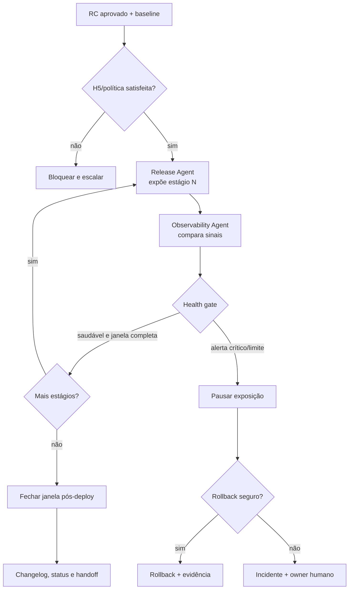

# Workflow 08 — produção e observação

> Bloco executável do [🐤 Canary Loop](../docs/loops/08-production-release-and-observation.md): promove o release candidate aprovado por estágios de exposição e usa sinais independentes para avançar, pausar ou reverter.

O Release Agent executa a política; o Observability Agent julga saúde contra um baseline fixado antes do rollout. Separar execução e interpretação impede que o desejo de concluir transforme regressão em “ruído provável”.

---

## Resultado do bloco

Uma execução fechada comprova qual artefato foi exposto, em que proporção, com quais autorizações e sinais, e por que a exposição avançou ou recuou. O loop só termina após a janela pós-deploy; “deploy aceito pela plataforma” é início da observação, não conclusão.

| Camada | Condição de fechamento |
|---|---|
| **Loop** | todos os estágios autorizados passaram seus health gates ou rollback/pausa foi concluído |
| **Agentes** | Release executou; Observability interpretou sem mover baseline ou silenciar alerta |
| **Plataforma** | release/digest, configuração, exposição e resultado foram consultados/registrados |
| **Workspace** | Work Item, health report, changelog, `STATUS.md` e board estão reconciliados |
| **Aprendizado** | desvios e decisões geraram candidatos ligados à evidência, sem promoção automática a conhecimento |

---

## Contrato operacional

| Contrato | Definição |
|---|---|
| **Etapa** | 8 — release e operação |
| **Unidade de execução** | um `release_id` + digest + estratégia de exposição + janela declarada |
| **Consolida operação** | [Release Agent](../agents/release-agent/AGENT.md) |
| **Interpreta saúde** | [Observability Agent](../agents/observability-agent/AGENT.md) |
| **Owner humano** | Tech Lead; PM coaprova R3/R4 e impacto material de produto |
| **Entrada** | RC homologado, rollout/rollback, SLOs, métricas, alertas, baseline e autorizações |
| **Saída** | release, health report, changelog, timeline e rollback/pausa/incidente quando aplicável |
| **Gate pré-exposição** | proveniência, ambiente, secrets, migração, backup, capacidade de rollback e H5/política |
| **Gate por estágio** | sinais dentro dos limites durante janela mínima; alerta crítico explicado ou exposição parada |
| **Gate final** | janela pós-deploy completa sem regressão relevante e estado persistido |
| **Volta dominante** | externa — cada estágio observa produção; regressão retorna por pausa/rollback |
| **Próximo workflow** | [09 — curadoria de conhecimento](09-knowledge-curation.md), para aprendizados candidatos |

---

## Preflight de produção

1. Confirmar `release_id`, RC/digest homologado, source commit, registro de H4 e aceite do Rehearsal.
2. Consultar estado atual do ambiente de destino, release em curso, mudanças concorrentes e janela operacional.
3. Verificar secrets autorizados sem expor valores, compatibilidade de config, migrations, backups e capacidade testada de rollback/roll-forward.
4. Capturar baseline antes da exposição: SLOs, erros, latência, saturação, métricas de produto e janelas comparáveis.
5. Fixar estágios, percentuais/coortes, duração mínima, health gates, thresholds, pause/rollback triggers e owner de incidente.
6. Confirmar autorizações externas e H5 conforme risco. R3/R4 nunca entram em produção por silêncio.
7. Abrir evidence pack/timeline antes da primeira ação externa.

### Envelope de abertura

```yaml
mission_id: "CANARY-<id>"
work_item_id: "<WI-id>"
workflow: "08-production-release-and-observation"
release:
  id: "<release-id>"
  candidate_id: "<RC-id>"
  version: "<version>"
  digest: "<digest>"
  source_commit: "<sha>"
environment: "<production-target>"
risk: "<classe>"
strategy:
  type: canary | feature_flag | progressive | full
  stages: []
baseline_window: "<range>"
observation_window: "<duration>"
health_gates: []
rollback_triggers: []
permissions: []
approvals: []
stop_conditions: []
```

---

## Plano de missões e estágios



| Missão | Responsável | Saída |
|---|---|---|
| M1 — preparar release | Release Agent | verificações pré-exposição e plano materializado |
| M2 — capturar baseline | Observability Agent | janela, consultas, valores e limitações |
| M3 — expor estágio | Release Agent | ação, coorte/percentual, versão e timestamp confirmados pela plataforma |
| M4 — observar estágio | Observability Agent | comparação, anomalias, confiança e recomendação |
| M5 — decidir transição | política/Tech Lead conforme risco | avançar, manter, pausar ou reverter |
| M6 — responder regressão | Release + Observability + incident owner | contenção, rollback/roll-forward, timeline e impacto |
| M7 — fechar janela | Release Agent | release final, changelog, health report e estado reconciliado |

M3 e M4 não são paralelos: primeiro a plataforma confirma exposição; depois o observador avalia a janela. M4 pode ler múltiplos sinais em paralelo, mas produz uma recomendação única com divergências explícitas.

---

## Health gate por estágio

Cada estágio declara:

| Campo | Exemplo de função |
|---|---|
| exposição/coorte | limita blast radius |
| início e duração mínima | impede conclusão cedo demais |
| baseline comparável | evita atribuir sazonalidade ao release |
| métricas e SLOs | define sucesso operacional e de produto |
| thresholds/warning/critical | elimina interpretação oportunista |
| decisão automática permitida | pausa/rollback apenas quando autorizados |
| owner para sinal inconclusivo | garante parada com decisão, não avanço por silêncio |

Baseline não é recalculado para acomodar regressão. Mudança de baseline durante o rollout exige motivo externo comprovado e nova decisão.

---

## Fronteiras de autoridade

| Participante | Faz | Não faz |
|---|---|---|
| Release Agent | verifica proveniência, executa estágio autorizado, pausa/rollback autorizado e registra release | amplia exposição além da política ou interpreta sozinho sinal contraditório |
| Observability Agent | correlaciona sinais, compara baseline, recomenda e executa apenas pausa/rollback previamente autorizado | silencia alerta, redefine baseline ou aprova release |
| Tech Lead/PM | autorizam H5, exceção e continuidade em risco material | têm consentimento inferido por ausência |
| incident owner | assume comando quando impacto ultrapassa rollout | deixa incidente apenas em log transitório após estabilização |

---

## Skills e contexto mínimo

| Agente | Skills prioritárias |
|---|---|
| todos | `workspace-memory`, `workspace-projects`, `workspace-board` conforme operação |
| Release Agent | `check-pr`, `update-pr`, `dev-flow`, `update-docs` |
| Observability Agent | `analyse-bug`, `technical-discovery`, `update-docs` |

Cada envelope registra `skills_used`. Release recebe artefato, política e controles; Observability recebe release/timeline, consultas, SLOs e métricas. Segredos nunca entram em envelopes/evidence pack.

---

## Persistência e evidência

| Artefato | Fonte canônica | Writer |
|---|---|---|
| registro/changelog da release | sistema autorizado de release | Release Agent |
| health report e timeline | `<tech-lead-workspace>/projects/<project>/execution/evidence/<release-id>/health-report.md` | Observability Agent |
| evidência de rollout | `execution/evidence/<release-id>/rollout/` | Release Agent |
| evidence pack de rollback | `execution/evidence/<release-id>/rollback/` | Release + Observability |
| Work Item/STATUS/BOARD | workspace Tech Lead | executor autorizado, após estado externo confirmado |
| candidatos a aprendizado | `projects/<project>/LEARNINGS.md` | owner autorizado; com links, ainda não conhecimento canônico |
| incidente/alerta em curso | `.coordination/` até promoção | incident owner |

Toda ação externa registra intent, ator, parâmetros não secretos, resposta da plataforma, timestamp e resultado observado. Após estabilização, incidente material é promovido à fonte oficial; não permanece apenas em `.coordination/`.

---

## Gates

### Gate pré-exposição

- [ ] digest homologado é o digest a promover;
- [ ] ambiente, config, secrets autorizados e mudanças concorrentes foram verificados;
- [ ] migração/backup e rollback ou roll-forward são executáveis;
- [ ] baseline, thresholds, estágios e janela estão fixados;
- [ ] owners, permissões e H5 aplicáveis estão registrados.

### Gate por estágio/final

- [ ] plataforma confirmou versão e exposição pretendidas;
- [ ] janela mínima decorreu e sinais foram comparados ao baseline;
- [ ] alertas warning/critical têm explicação/evidência ou exposição foi pausada;
- [ ] sinais de produto e operação foram considerados conforme risco;
- [ ] estágio só avançou por política/decisão autorizada;
- [ ] janela final terminou sem regressão relevante.

### Gate de execução em bloco

- [ ] executor e intérprete permaneceram separados;
- [ ] cada estágio está na timeline com decisão e evidência;
- [ ] rollback/pausa foi acionado quando threshold exigiu;
- [ ] release, health report, Work Item, `STATUS.md` e board concordam;
- [ ] candidatos a aprendizado preservam fato/hipótese e links.

---

## Regressão e escalonamento

| Condição | Ação |
|---|---|
| alerta crítico não explicado | pausar imediatamente; não ampliar exposição |
| regressão com rollback seguro | executar rollback autorizado e comprovar recuperação |
| rollback inseguro/migração irreversível | abrir incidente e Tech Lead decide contenção/roll-forward |
| sinais contraditórios | manter/pausar exposição; Observability registra confiança e escala |
| perda de dados/SLO crítico | incidente imediato, preservação segura de evidência e comunicação |
| defeito confirmado | Ralph Loop; novo artefato percorre validação/PR/homologação |
| impacto excede plano | owner humano assume; automação não expande escopo de mitigação |

O loop não fecha enquanto saúde não tiver sido restabelecida e comprovada, mesmo que o rollback tenha sido aceito pela plataforma.

---

## Envelope final

```yaml
mission_id: "CANARY-<id>"
work_item_id: "<WI-id>"
workflow: "08-production-release-and-observation"
status: completed | partial | blocked
transition: released_stable | rolled_back | paused | incident_open
release:
  id: "<release-id>"
  digest: "<digest>"
  source_commit: "<sha>"
  final_exposure: "<percent-or-cohort>"
stages: []
baseline: "<path>"
health_report: "<path>"
skills_used: []
alerts: []
rollback:
  executed: false
  evidence: null
incident: null
outputs_created: []
decisions_recorded: []
learning_candidates: []
gates:
  passed: []
  failed: []
  not_run: []
handoff_to: []
```

`released_stable` exige janela completa e estado externo confirmado; deploy bem-sucedido sozinho nunca satisfaz o bloco.
