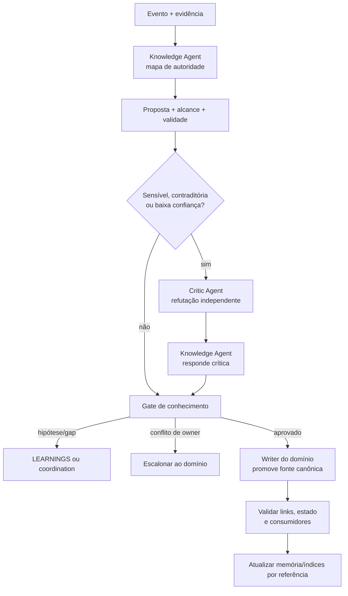

# Workflow 09 — curadoria de conhecimento

> Bloco executável do [🗄️ Archivist Loop](../docs/loops/09-knowledge-curation.md): transforma evidência de entrega, decisão ou incidente em atualização da fonte canônica correta, sem promover memória temporária a regra.

Este workflow fecha a distância entre “o sistema mudou” e “as instruções agora descrevem o sistema real”. Toda atualização possui gatilho observável, writer único, owner humano, evidência, alcance, data e limite de validade.

---

## Resultado do bloco

Uma execução fechada atualiza exatamente uma fonte autoritativa por conceito, preserva histórico e registra o que permaneceu hipótese. Conteúdo sensível, contraditório ou de baixa confiança passa por Critic independente antes de orientar agentes futuros.

| Camada | Condição de fechamento |
|---|---|
| **Loop** | mudança e evidência foram mapeadas para fontes afetadas e contradições resolvidas |
| **Agentes** | Knowledge consolidou; Critic contestou quando acionado sem editar o artefato |
| **Workspaces/repositórios** | cada owner escreveu no próprio domínio; links cruzados não viraram cópias autoritativas |
| **Ciclo documental** | `proposed/canonical/superseded/archived` e sucessores estão explícitos |
| **Memória** | apenas aponta para decisões/fatos canônicos; hipóteses continuam marcadas |

---

## Contrato operacional

| Contrato | Definição |
|---|---|
| **Etapa** | 9 — conhecimento e melhoria |
| **Unidade de execução** | um gatilho documental identificado por `knowledge_change_id` |
| **Consolida** | [Knowledge Agent](../agents/knowledge-agent/AGENT.md) |
| **Desafia** | [Critic Agent](../agents/critic-agent/AGENT.md) quando mudança é sensível, contraditória, ampla ou de baixa confiança |
| **Owner humano** | owner do domínio/fonte alterada |
| **Entrada** | decisões, PRs, releases, homologação, incidentes, aprendizados candidatos e fontes atuais |
| **Saída** | fonte canônica atualizada ou proposta explícita, review, changelog de conhecimento e conflitos pendentes |
| **Gate de conteúdo** | origem, atualidade, alcance, validade e ausência de contradição silenciosa |
| **Gate do bloco** | conteúdo + writer/owner corretos + crítica proporcional + links/estado/reconciliação |
| **Volta dominante** | média — conclusão sensível é contestada antes da promoção |
| **Próximo workflow** | [10 — melhoria contínua](10-continuous-improvement.md) quando o próprio sistema de trabalho precisar mudar |

---

## Gatilhos de abertura

| Evento observável | Artefato candidato | Consolidador/owner |
|---|---|---|
| decisão arquitetural tomada/revertida | novo ADR; anterior fica `superseded` | Specification TL / Tech Lead |
| convenção adotada no código | `docs/rules/` correspondente | agente que introduziu / Tech Lead |
| procedimento repetido e estabilizado | `skills/<skill>/SKILL.md` | Knowledge / owner do domínio |
| comando de build/teste/execução alterado | `AGENTS.md` no mesmo change set | Software Engineer / Tech Lead |
| contrato público/schema alterado | regra, ADR e documentação de contrato | Specification TL / Tech Lead |
| incidente com causa raiz | rule, ADR, skill ou playbook | owner do domínio |
| aprendizado validado pelo Daily/Dream | `MEMORY.md` e/ou fonte de domínio | Knowledge / owner |
| gate, sensor, autonomia ou política alterados | documentação do harness + decisão | Tech Lead + crítico independente |

Entrada sem gatilho/evidência permanece candidato em `LEARNINGS.md` ou `.coordination/`; não é promovida por parecer plausível.

---

## Preflight de autoridade

1. Fixar `knowledge_change_id`, evento, fontes de evidência, conceito afetado, alcance e owner.
2. Inventariar todas as páginas que reivindicam autoridade sobre o conceito; se duas forem canônicas, bloquear a promoção até resolver ownership.
3. Ler a fonte vigente, seus links, estado, histórico/sucessores e o sistema real que ela descreve.
4. Consultar memória apenas para descoberta e confirmar cada afirmação em Work Items, decisões, código, release ou evidência.
5. Classificar a proposta: correção factual, nova regra, decisão, procedimento, aprendizado, supersessão ou arquivamento.
6. Avaliar sensibilidade/confiança e acionar Critic antes da escrita canônica quando necessário.
7. Resolver o writer do domínio. Knowledge Agent prepara handoff em vez de editar fonte que pertence a outro owner sem autorização.

### Envelope de abertura

```yaml
mission_id: "ARCHIVIST-<id>"
knowledge_change_id: "KC-<id>"
workflow: "09-knowledge-curation"
trigger:
  type: "<event>"
  source: "<path-or-record>"
concept: "<concept>"
current_canonical_source: "<path-or-unresolved>"
target_source: "<path>"
domain_owner: "<owner>"
change_type: correction | rule | decision | procedure | learning | supersede | archive
confidence: high | medium | low
sensitivity: low | medium | high
evidence: []
permissions: []
stop_conditions: []
```

---

## Plano de missões



| Missão | Responsável | Saída |
|---|---|---|
| M1 — mapear fontes | Knowledge Agent | autoridade, duplicidade, obsolescência e consumidores |
| M2 — propor mudança | Knowledge Agent | patch/proposta com origem, data, alcance, validade e impacto |
| M3 — criticar | Critic independente | confirmação, contestação ou pedido de evidência |
| M4 — responder | Knowledge Agent | resolução por finding ou hipótese preservada |
| M5 — decidir/promover | owner/writer do domínio | fonte canônica atualizada e estado documental correto |
| M6 — verificar | Knowledge Agent | links, referências, ausência de contradição e changelog |
| M7 — reconciliar contexto | Knowledge Agent | memória/índices apontam para fonte, sem duplicar verdade |

---

## Ciclo de vida documental

| Estado | Uso pelo agente | Transição |
|---|---|---|
| `proposed` | contexto; nunca regra vigente | owner aprova para `canonical` ou rejeita |
| `canonical` | fonte vigente do conceito | nova decisão pode superseder/arquivar |
| `superseded` | histórico e racional; nunca instrução atual | aponta para sucessor canônico |
| `archived` | investigação histórica | não possui sucessor obrigatório |

Documento sem `status` é tratado como `proposed`. ADR nunca é reescrita para apagar uma decisão anterior: uma nova ADR a supersede e liga passado/futuro.

---

## Fronteiras de autoridade

| Participante | Faz | Não faz |
|---|---|---|
| Knowledge Agent | encontra autoridade, propõe, consolida, verifica e mantém links | converte hipótese em regra ou decide domínio alheio |
| Critic Agent | tenta refutar sustentação, alcance e confiança | usa mesmo raciocínio do autor ou edita artefato criticado |
| owner/writer do domínio | aprova e promove conteúdo no destino canônico | tem aprovação presumida por silêncio |
| consumidor/agente futuro | segue somente `canonical` | trata memória, `.coordination/` ou `proposed` como regra |

---

## Skills e contexto mínimo

| Agente | Skills prioritárias |
|---|---|
| todos | `workspace-memory`, `workspace-projects`, `workspace-board` conforme operação |
| Knowledge Agent | `update-docs`, `refine-spec`, `technical-discovery` |
| Critic Agent | `review-prd`, `review-spec`, `code-review`, `review-cross-prd-spec` conforme a fonte |

Cada envelope registra `skills_used`. O Critic recebe proposta, evidências, critérios e fonte atual; não recebe conclusão privada do autor como fato.

---

## Persistência e promoção

| Artefato | Destino | Regra |
|---|---|---|
| atualização canônica | fonte do domínio | writer único autorizado |
| aprendizado candidato/aceito | `<tech-lead-workspace>/projects/<project>/LEARNINGS.md` | seção candidata não orienta como regra |
| review do Critic | `execution/reviews/knowledge-<id>.md` | quando acionado |
| ADR sucessora | `engineering/adr/<ADR-id>.md` | liga e supersede, não apaga anterior |
| proposta não decidida | `.coordination/` | trânsito com owner/prazo |
| changelog de conhecimento | ligado ao `knowledge_change_id` | fontes, before/after, consumidores e gate |
| `MEMORY.md` | workspace correspondente | índice/resumo com link; nunca única casa da decisão |

Promoção: persistir proposta/review → owner decide → writer atualiza fonte → validar links/consumidores → marcar documento anterior → registrar changelog → atualizar memória/índices por referência.

---

## Gates

### Gate de conhecimento

- [ ] gatilho, fonte, data e owner são localizáveis;
- [ ] conceito tem uma única fonte canônica identificada;
- [ ] texto descreve o estado real, não apenas intenção/histórico da entrega;
- [ ] alcance, contexto e limite de validade estão explícitos;
- [ ] fatos, inferências e hipóteses permanecem separados;
- [ ] contradições foram resolvidas ou bloqueiam promoção;
- [ ] estado documental e sucessores estão corretos.

### Gate de execução em bloco

- [ ] Critic atuou quando sensibilidade/confiança exigiu;
- [ ] crítica tem linha independente e respostas por finding;
- [ ] writer e owner do domínio autorizaram a promoção;
- [ ] links, índices, agentes/skills consumidores e documentação relacionada foram verificados;
- [ ] memória e `.coordination/` não foram tratadas como destino final;
- [ ] Work Item/changelog/evidência permitem auditar a mudança.

---

## Falhas e escalonamento

| Condição | Ação |
|---|---|
| duas fontes reivindicam autoridade | bloquear e owner do domínio escolhe/consolida |
| evidência insuficiente | manter como hipótese/candidato com próxima prova |
| evidências contraditórias | Critic + owner; não selecionar versão silenciosamente |
| mudança apaga decisão válida | criar sucessor/supersessão, preservando histórico |
| política, segurança ou autonomia afetada | revisão independente e decisão humana obrigatórias |
| writer/owner ausente | handoff bloqueado; Knowledge não assume domínio |
| implementação diverge da rule | corrigir código ou superseder rule por decisão; nunca apenas “atualizar docs” para legitimar desvio |

---

## Envelope final

```yaml
mission_id: "ARCHIVIST-<id>"
knowledge_change_id: "KC-<id>"
workflow: "09-knowledge-curation"
status: completed | partial | blocked
transition: canonical_updated | proposal_pending | hypothesis_preserved | owner_blocked
trigger: "<event>"
canonical_source: "<path>"
previous_source_state: "<state>"
new_source_state: "<state>"
domain_owner: "<owner>"
agents_run: []
skills_used: []
sources_used: []
outputs_created: []
consumers_checked: []
contradictions: []
critic_findings:
  resolved: []
  open: []
decisions_requested: []
decisions_recorded: []
gates:
  passed: []
  failed: []
  not_run: []
handoff_to: []
```

`canonical_updated` exige fonte vigente identificada, owner autorizado, contradições resolvidas e consumidores verificáveis.
