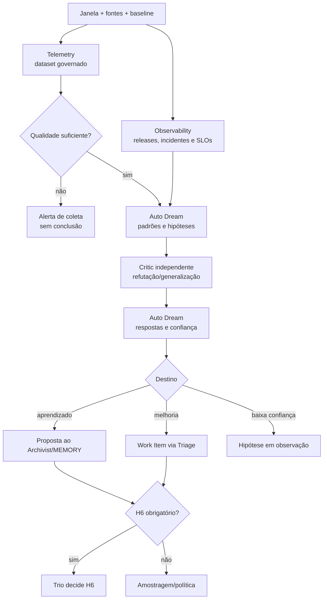

# Workflow 10 — telemetria e melhoria contínua

> Bloco executável do [🌙 Dream Loop](../docs/loops/10-continuous-improvement.md): compara o comportamento semanal do sistema de trabalho com um baseline governado e transforma padrões em aprendizado validado ou demanda priorizável.

O objeto deste workflow são os loops, gates, handoffs e workspaces — não a avaliação individual de agentes. Telemetry produz dados e limitações; Auto Dream formula hipóteses; Critic tenta refutá-las; o trio decide H6 quando a proposta afeta memória sensível, prioridade crítica, gate, política ou autonomia.

---

## Resultado do bloco

Uma execução fechada produz um relatório periódico reproduzível e dá a cada conclusão exatamente um destino: aprendizado validado, Work Item de melhoria ou hipótese em observação. Observação genérica sem owner/critério não é saída.

| Camada | Condição de fechamento |
|---|---|
| **Loop** | janela, baseline, dataset, qualidade e análise estão identificados |
| **Agentes** | Telemetry não inferiu causalidade; Auto Dream não priorizou; Critic independente avaliou generalização |
| **Workspaces** | relatório técnico, memória e backlog permanecem em suas fontes/owners corretos |
| **Decisão** | H6 foi executado quando obrigatório; PM ordena demanda no backlog normal |
| **Governança** | nenhuma proposta alterou o próprio gate/autonomia sem owner e aprovação |

---

## Contrato operacional

| Contrato | Definição |
|---|---|
| **Etapa** | 10 — conhecimento e melhoria |
| **Cadência** | semanal e extraordinária após incidente relevante |
| **Unidade de execução** | uma janela fechada `period_id`, com baseline comparável e corte de dados explícito |
| **Consolida** | [Auto Dream Agent](../agents/auto-dream-agent/AGENT.md) |
| **Produz dados** | [Telemetry Agent](../agents/telemetry-agent/AGENT.md) |
| **Complementa operação** | [Observability Agent](../agents/observability-agent/AGENT.md) |
| **Desafia** | [Critic Agent](../agents/critic-agent/AGENT.md), independente |
| **Owner humano** | trio; PM ordena backlog; owner do domínio decide execução |
| **Entrada** | eventos/sessões, gates, retries, feedback, incidentes, custos, métricas, Daily hypotheses e demandas anteriores |
| **Saída** | relatório, proposta de memória, Work Items de melhoria e hipóteses em observação |
| **Gate de conteúdo** | evidência, contexto, confiança, validade, privacidade, qualidade e contradições tratados |
| **Gate do bloco** | conteúdo + crítica + destinos persistidos + H6/política + reconciliação |
| **Volta dominante** | do sistema — realimenta o desenho dos demais loops |

---

## Preflight da janela

1. Fixar `period_id`, início/fim, timezone, projetos/workspaces incluídos e timestamp de corte.
2. Congelar definições de métricas e baseline antes de observar o resultado. Alterar definição após ver os dados invalida comparação.
3. Inventariar fontes: sessões, envelopes, gates, CI, reviews, releases, incidentes, custos, feedbacks e hipóteses do Daily Loop.
4. Validar permissões, retenção e minimização; remover secrets e dados pessoais antes de disponibilizar dataset à análise.
5. Correlacionar `mission_id`, `work_item_id`, `workflow`, gate, release e decisão; medir cobertura e eventos órfãos.
6. Registrar falhas de coleta e comparabilidade. Queda de métrica causada por coleta ausente é alerta, não melhoria.
7. Confirmar Critic independente e owners possíveis dos destinos.

### Envelope de abertura

```yaml
mission_id: "DREAM-<id>"
workflow: "10-continuous-improvement"
period:
  id: "<YYYY-Www>"
  start: "<timestamp>"
  end: "<timestamp>"
  timezone: "<tz>"
  cutoff: "<timestamp>"
scope:
  workspaces: []
  projects: []
baseline: "<period-or-version>"
metric_definitions: "<path@revision>"
sources: []
privacy_policy: "<path>"
h6_triggers: []
permissions: []
stop_conditions: []
```

---

## Plano de missões



| Missão | Responsável | Saída |
|---|---|---|
| M1 — governar dados | Telemetry Agent | dataset, esquema, origem, cobertura, retenção, qualidade e limitações |
| M2 — contexto operacional | Observability Agent | releases, rollbacks, incidentes, SLOs e baselines de saúde |
| M3 — analisar sistema | Auto Dream Agent | padrões por loop/causa/impacto, hipóteses e confiança |
| M4 — criticar | Critic Agent | contestação de evidência, causalidade, amostra, viés e generalização |
| M5 — consolidar destinos | Auto Dream Agent | aprendizado, demanda ou hipótese; nunca mistura os três |
| M6 — decidir H6 | trio/owner do sistema | aceitar, ajustar, observar ou rejeitar propostas sensíveis |
| M7 — persistir | Knowledge/Intake owners | memória por gate do Archivist; Work Item pelo Triage |

M1 e M2 podem rodar em paralelo. M3 só inicia após o relatório de qualidade; o Auto Dream não recebe dados brutos não minimizados.

---

## Métricas e uso seguro

O relatório pode medir por loop:

- lead/cycle time e tempo em espera;
- número de voltas internas, médias e externas;
- gate pass/fail/not-run e revalidações;
- bloqueios, escalonamentos e causas;
- retrabalho após H2/H3/H4;
- defeitos escapados, rollback e incidentes;
- custo, cobertura de evidence packs e qualidade de handoff;
- níveis de autonomia e intervenções humanas registradas.

Esses sinais avaliam desenho do fluxo. Alta taxa de retorno externo pode indicar entrada ruim ou gate tardio; não autoriza ranking de agente. Causalidade é hipótese até haver teste/controle suficiente.

---

## Contrato dos três destinos

| Destino | Conteúdo mínimo | Gate seguinte |
|---|---|---|
| aprendizado | observação, contexto, evidência, alcance, confiança, validade e revisão futura | Archivist; H6 quando sensível |
| demanda de melhoria | sintoma, frequência, impacto, evidência, causa provável, critério de aceite, owner recomendado e risco | Triage; PM prioriza na mesma fila do produto |
| hipótese em observação | pergunta, sinal atual, evidência faltante e condição de promoção/descarte | próxima janela ou evento definido |

Auto Dream não edita memória sensível sozinho, não cria prioridade definitiva e não altera gate/política/autonomia diretamente.

---

## Skills e contexto mínimo

| Agente | Skills prioritárias |
|---|---|
| todos | `workspace-memory`, `workspace-projects`, `workspace-board` conforme operação |
| Telemetry | `technical-discovery`, `analyse-bug`, `update-docs` |
| Observability | `analyse-bug`, `technical-discovery`, `update-docs` |
| Auto Dream | `analyse-bug`, `technical-discovery`, `update-docs` |
| Critic | `review-prd`, `review-spec`, `code-review`, `review-cross-prd-spec` conforme a conclusão |

Cada envelope registra `skills_used`. O Critic recebe relatório, dataset governado/agregado, definições e hipóteses; não recebe dados pessoais ou a narrativa privada do Auto Dream.

---

## Persistência multiworkspace

| Artefato | Fonte canônica | Writer |
|---|---|---|
| relatório/dataset/qualidade | `<tech-lead-workspace>/projects/<project>/execution/telemetry/<period-id>.md` | Telemetry Agent |
| relatório Dream | `execution/telemetry/<period-id>-dream.md` | Auto Dream Agent |
| review do Critic | `execution/reviews/dream-<period-id>.md` | Critic Agent |
| memória validada | `MEMORY.md` do workspace correspondente | Knowledge Agent após gate/owner |
| demanda de melhoria | `<pm-workspace>/projects/<project>/work-items/<WI-id>.md` | Intake Agent após triagem |
| hipótese aberta | `.coordination/observations/` até próxima evidência | Auto Dream; trânsito |
| decisão H6 | fonte de decisões do sistema de trabalho | trio/owner |

Relatório não substitui Work Item. Melhoria só está encaminhada quando chegou ao intake; aprendizado só está vigente quando passou pelo Archivist e foi promovido.

---

## Gates

### Gate de dados e análise

- [ ] janela, corte, baseline e definições são estáveis e comparáveis;
- [ ] origem, cobertura, retenção e limitações estão explícitas;
- [ ] secrets/dados pessoais foram removidos antes da análise;
- [ ] eventos órfãos e falhas de coleta estão quantificados;
- [ ] padrão, ocorrência isolada, correlação, hipótese e causalidade estão separados;
- [ ] cada conclusão possui evidência, contexto, confiança e validade.

### Gate de execução em bloco

- [ ] Critic usou linha independente e cada contestação recebeu resposta;
- [ ] conclusões contraditórias/baixa confiança não foram promovidas;
- [ ] cada saída possui exatamente um destino e owner;
- [ ] memória e backlog foram atualizados por seus workflows/owners, não pelo Auto Dream diretamente;
- [ ] H6 ocorreu para P0/P1, memória sensível e toda mudança de gate/política/autonomia;
- [ ] relatório, reviews, decisões e destinos estão ligados pelo `period_id`.

---

## H6, falhas e escalonamento

| Condição | Ação |
|---|---|
| falha/queda de coleta | abrir alerta de telemetria; não concluir melhoria |
| dados pessoais/secrets | interromper, remover com segurança e revisar acesso/retenção |
| métricas não comparáveis | marcar `blocked/partial`; redefinir próxima janela antes de coletar |
| baixa confiança/amostra insuficiente | manter hipótese com condição de nova evidência |
| P0/P1, memória sensível, gate/política/autonomia | H6 obrigatório |
| demanda de baixo risco | segue política/amostragem, mas entra no Triage |
| contradição não resolvida | bloquear atualização automática e escalar ao trio |
| proposta relaxa gate que a avaliaria | revisão independente + owner humano; nunca autoaprovação |

---

## Envelope final

```yaml
mission_id: "DREAM-<id>"
workflow: "10-continuous-improvement"
status: completed | partial | blocked
transition: period_closed | awaiting_h6 | data_quality_blocked
period_id: "<YYYY-Www>"
baseline: "<period-or-version>"
agents_run: []
skills_used: []
data_quality:
  coverage: "<value>"
  limitations: []
  privacy_incidents: []
patterns: []
hypotheses: []
learning_proposals: []
improvement_work_items: []
critic_findings:
  resolved: []
  open: []
h6:
  required: false
  decision: null
outputs_created: []
gates:
  passed: []
  failed: []
  not_run: []
handoff_to: []
```

`period_closed` exige que dados, crítica, destinos e decisões sejam auditáveis; publicar um relatório não equivale a melhorar o sistema.
