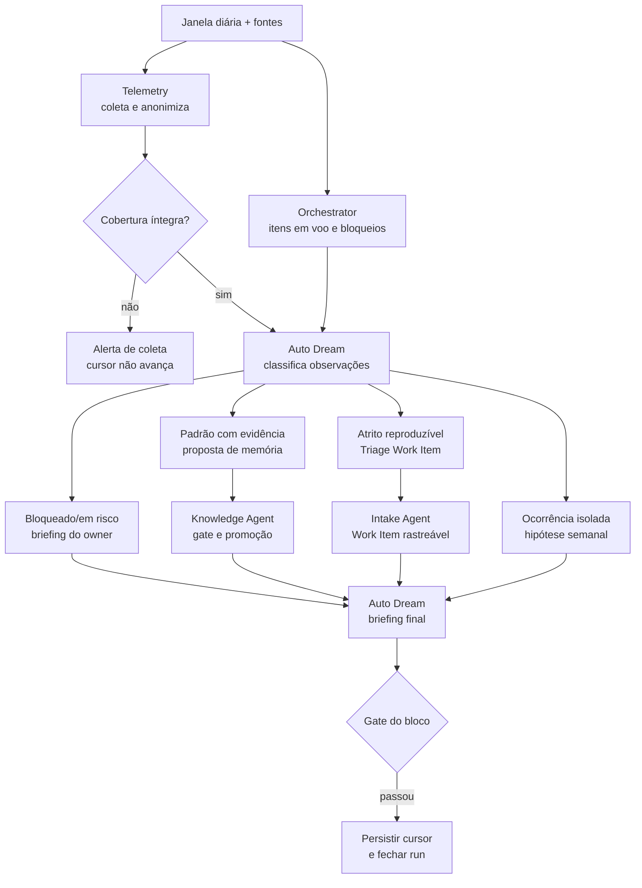

# Workflow 11 — operação diária

> Bloco executável do [☀️ Daily Loop](../docs/loops/11-daily-operations.md): lê tudo o que terminou ou permaneceu em voo desde o último corte e entrega ao owner decisões, riscos, memória proposta e melhorias com destino explícito.

O Daily Loop gira por calendário, não por Work Item. Registrar o dia não é priorizá-lo: Auto Dream separa e sinaliza; Knowledge promove memória pelo gate correto; Intake transforma atrito reproduzível em Work Item; o owner decide.

---

## Resultado do bloco

Uma execução fechada deixa um briefing curto e ordenado, um cursor de coleta avançado com segurança e cada observação encaminhada para um dos quatro destinos: decisão do owner, proposta de memória, Work Item no intake ou hipótese em observação. Nada sobrevive apenas como narrativa no briefing.

| Camada | Condição de fechamento |
|---|---|
| **Loop** | janela completa foi coletada e toda afirmação aponta para sessão/envelope/item identificável |
| **Agentes** | Telemetry coletou; Orchestrator reconciliou voo; Auto Dream classificou; Knowledge/Intake promoveram destinos |
| **Workspace** | briefing, memória, Work Items, bloqueios e cursor concordam com fontes canônicas |
| **Owner** | bloqueados e riscos trazem decisão solicitada, impacto e prazo |
| **Cadência** | cursor só avança depois da persistência; retry não duplica briefing, memória ou Work Item |

---

## Contrato operacional

| Contrato | Definição |
|---|---|
| **Etapa** | 11 — conhecimento e melhoria |
| **Cadência** | diária, por workspace, mesmo sem entrega concluída |
| **Unidade de execução** | janela `(last_successful_cutoff, current_cutoff]` identificada por `daily_run_id` |
| **Consolida** | [Auto Dream Agent](../agents/auto-dream-agent/AGENT.md) |
| **Coleta** | [Telemetry Agent](../agents/telemetry-agent/AGENT.md) |
| **Reconcilia voo** | [Orchestrator Agent](../agents/orchestrator-agent/AGENT.md) |
| **Promove memória** | [Knowledge Agent](../agents/knowledge-agent/AGENT.md) |
| **Recebe melhorias** | [Intake Agent](../agents/intake-agent/AGENT.md) |
| **Owner humano** | owner do workspace |
| **Entrada** | sessões encerradas, envelopes, gates, retries, escalonamentos e itens em voo desde o último corte |
| **Saída** | briefing, propostas de memória, Work Items, hipóteses e alerta de coleta quando necessário |
| **Gate de conteúdo** | afirmações rastreáveis; decisões com owner/prazo; melhorias promovidas ou descartadas explicitamente |
| **Gate do bloco** | conteúdo + privacidade + cursor idempotente + destinos persistidos + briefing dentro do budget |
| **Volta dominante** | do sistema, com janela diária |

---

## Preflight e cursor

1. Resolver workspace, owner, timezone, `daily_run_id`, último corte concluído e corte atual.
2. Ler regras do workspace, `BOARD.md`, projetos ativos e `STATUS.md`; memória serve apenas para contexto.
3. Verificar se já existe run para a mesma janela. Retomada completa o run existente; não cria outro briefing.
4. Inventariar fontes de sessão/envelopes e itens em voo; registrar cobertura esperada antes da coleta.
5. Fixar política de minimização/anonimização, validade do briefing e budget de leitura do owner (alvo: até 10 minutos).
6. Criar estado transitório do run sem mover o cursor de sucesso.

### Envelope de abertura

```yaml
daily_run_id: "DAILY-<YYYY-MM-DD>-<workspace>"
workflow: "11-daily-operations"
workspace: "<workspace-id>"
owner: "<owner>"
window:
  start_exclusive: "<last-successful-cutoff>"
  end_inclusive: "<current-cutoff>"
  timezone: "<tz>"
sources_expected: []
briefing_budget:
  max_read_minutes: 10
privacy_policy: "<path>"
permissions: []
stop_conditions: []
```

Cursor anterior ausente exige bootstrap explícito com alcance declarado; não autoriza ler histórico ilimitado. Falha de coleta não move o cursor.

---

## Plano de missões



| Missão | Responsável | Saída |
|---|---|---|
| M1 — coletar janela | Telemetry Agent | sessões/envelopes correlacionados, custo, gates, retries, cobertura e limitações |
| M2 — reconciliar voo | Orchestrator Agent | itens ativos, tempo em estado, dependências, bloqueios e decisão pendente |
| M3 — classificar | Auto Dream Agent | concluído, pendente, falha/causa e decisão humana; mais quatro destinos operacionais |
| M4 — promover memória | Knowledge Agent | entrada validada com origem/contexto/validade ou proposta rejeitada |
| M5 — abrir melhoria | Intake Agent | Work Item com sintoma, evidência, impacto, causa provável e owner recomendado |
| M6 — montar briefing | Auto Dream Agent | bloqueados → em risco → em andamento, dentro do budget |
| M7 — fechar run | executor | artefatos/destinos persistidos e cursor avançado atomicamente |

M1 e M2 rodam em paralelo. M4 e M5 também podem rodar em paralelo depois da classificação, pois escrevem fontes diferentes. Auto Dream não edita memória nem backlog diretamente.

---

## Classificação e destinos

| Natureza observada | Critério | Destino |
|---|---|---|
| decisão/bloqueio | somente owner pode resolver e há impacto atual | briefing `bloqueado` com pergunta/prazo |
| risco próximo | evidência indica que vai bloquear dentro de horizonte declarado | briefing `em risco` com prevenção possível |
| andamento | estado confirmado sem ação humana necessária | briefing informativo e compacto |
| padrão recorrente | múltiplas sessões sustentam a mesma conclusão contextual | proposta ao Knowledge/Archivist; não escrita direta |
| atrito reproduzível | sintoma, passos/evidência e impacto identificáveis | Intake Work Item; PM prioriza depois |
| ocorrência isolada | evidência real, mas recorrência/causa não confirmadas | hipótese para Dream Loop |
| ruído/sem ação | não muda decisão, memória, backlog ou risco | descarte registrado no run, não no briefing |

O mesmo evento pode gerar sinalização e melhoria, mas usa IDs cruzados para não virar duas verdades.

---

## Contrato do briefing

O briefing tem validade de um dia e ordem obrigatória:

1. **Bloqueado** — decisão necessária hoje; owner, pergunta, opções, recomendação, impacto e prazo.
2. **Em risco** — vai bloquear se ninguém agir; evidência, horizonte e ação preventiva.
3. **Em andamento** — mudanças relevantes, próximos gates e informação apenas operacional.
4. **Destinos criados** — links para memória proposta, Work Items e hipóteses; não repete o conteúdo.
5. **Qualidade do run** — cobertura, fontes faltantes e limitações.

Sem bloqueios/riscos, as seções permanecem curtas e dizem “nenhum identificado com as fontes coletadas”; falha de coleta produz alerta, nunca certeza vazia.

---

## Fronteiras de autoridade

| Participante | Faz | Não faz |
|---|---|---|
| Telemetry | coleta, correlaciona, anonimiza e mede cobertura | conclui causa ou prioridade |
| Orchestrator | descreve estado autoritativo, bloqueios e dependências | decide destino/prioridade |
| Auto Dream | classifica, formula hipótese e consolida briefing | edita memória, cria prioridade ou altera gate/política/autonomia |
| Knowledge | avalia/promove memória na fonte correta | transforma hipótese isolada em regra |
| Intake | cria/relaciona Work Item rastreável | prioriza definitivamente |
| owner do workspace | responde decisões e aceita/descarta sinalização | tem resposta inferida por silêncio |

---

## Skills e contexto mínimo

| Agente | Skills prioritárias |
|---|---|
| todos | `workspace-memory`, `workspace-projects`, `workspace-board` conforme operação |
| Telemetry | `technical-discovery`, `analyse-bug`, `update-docs` |
| Orchestrator | `dev-flow`, `update-docs` |
| Auto Dream | `analyse-bug`, `technical-discovery`, `update-docs` |
| Knowledge | `update-docs`, `refine-spec`, `technical-discovery` |
| Intake | `business-discovery`, `write-feature` |

Cada envelope registra `skills_used`. Auto Dream recebe dados já minimizados e o resumo autoritativo de itens; não recebe secrets, dados pessoais desnecessários ou memória privada de outro workspace.

---

## Idempotência e escrita multiagente

- `daily_run_id` e janela são únicos por workspace; retry retoma o mesmo run.
- Cada evento/sessão tem ID e só é classificado uma vez por janela.
- Knowledge deduplica proposta pela evidência/conceito; Intake procura Work Item existente antes de criar outro.
- Writers permanecem separados: Auto Dream escreve briefing/run; Knowledge escreve memória; Intake escreve Work Item; Orchestrator reconcilia estado.
- Cursor só avança após briefing e todos os destinos obrigatórios estarem persistidos.
- Correção posterior cria errata ligada ao briefing; não reescreve silenciosamente o histórico diário.

---

## Persistência

| Artefato | Destino | Validade/autoridade |
|---|---|---|
| briefing diário | `<workspace-owner>/.coordination/daily/<date>.md` | válido por um dia; artefato final próprio do loop |
| estado/cursor do run | `.coordination/daily/state/` | controle idempotente da cadência |
| proposta/memória | `MEMORY.md` correspondente | somente após Knowledge/owner; aponta para evidência |
| Work Item de melhoria | `<pm-workspace>/projects/<project>/work-items/<WI-id>.md` | fonte autoritativa após Triage |
| hipótese em observação | `.coordination/observations/` | trânsito para Dream Loop |
| coleta anonimizada | `execution/telemetry/daily/<date>/` ou registro governado equivalente | insumo do Dream; retenção declarada |

O briefing é exceção legítima em `.coordination/` porque expira. Tudo que precisa sobreviver ao dia deve estar em memória, Work Item ou hipótese explicitamente encaminhada.

---

## Gates

### Gate de conteúdo

- [ ] janela/cursor e cobertura de fontes estão explícitos;
- [ ] secrets/dados pessoais foram removidos antes da análise;
- [ ] toda afirmação aponta para sessão, envelope, gate ou Work Item;
- [ ] bloqueados/riscos têm owner, decisão, impacto e prazo;
- [ ] melhoria reproduzível virou Work Item ou descarte registrado;
- [ ] hipótese isolada não foi promovida à memória;
- [ ] briefing respeita ordem e budget de leitura.

### Gate de execução em bloco

- [ ] writers e domínios foram respeitados;
- [ ] memória passou pelo Knowledge e melhoria passou pelo Intake;
- [ ] Work Item, estado em voo e briefing não se contradizem;
- [ ] retry/deduplicação não criou saídas duplicadas;
- [ ] todos os destinos estão persistidos antes do cursor;
- [ ] alteração de gate/política/autonomia foi enviada ao Dream/H6, nunca aplicada aqui.

---

## Falhas e escalonamento

| Condição | Ação |
|---|---|
| coleta incompleta/falhou | alertar owner/Telemetry; manter cursor; não emitir briefing “sem novidades” |
| item bloqueado por mais de um ciclo | destacar no topo e escalar ao owner com tempo acumulado |
| escalonamento sem resposta | repetir como bloqueado, sem inventar decisão |
| melhoria recorrente sem Work Item | bloquear fechamento do destino ou registrar descarte explícito pelo owner |
| memória cresce sem validade | Knowledge revisa/expira; não acumular por padrão |
| conflito entre briefing e Work Item | Work Item vence; corrigir briefing e investigar coleta |
| proposta afeta gate/política/autonomia | encaminhar ao Dream Loop/H6 |

---

## Envelope final

```yaml
daily_run_id: "DAILY-<YYYY-MM-DD>-<workspace>"
workflow: "11-daily-operations"
status: completed | partial | blocked
transition: briefing_ready | collection_blocked | destinations_pending
workspace: "<workspace-id>"
window:
  start_exclusive: "<timestamp>"
  end_inclusive: "<timestamp>"
coverage:
  expected: 0
  collected: 0
  missing: []
agents_run: []
skills_used: []
briefing: "<path>"
blocked_items: []
at_risk_items: []
memory_proposals: []
improvement_work_items: []
hypotheses_for_dream: []
discarded_observations: []
decisions_requested: []
outputs_created: []
cursor:
  advanced: false
  new_cutoff: null
gates:
  passed: []
  failed: []
  not_run: []
handoff_to: []
```

`briefing_ready` exige cursor avançado somente após todos os destinos; run com coleta falha permanece `collection_blocked`.
