# Agent Team — fluxo da jornada

> Visão visual do [sistema operacional do trio humano](../rules/operating-model.md) e do [modelo operacional 90/10](operating-model-90-10.md) · [Fluxos separados por fase](journey-by-phase.md) · [workflows multiagente](../workflows/README.md).

Cada etapa com colaboração entre agentes possui um contrato detalhado no [mapa de workflows](../workflows/README.md): [intake](../workflows/00-intake-and-triage.md), [discovery](../workflows/01-discovery-and-research.md), [produto e UX](../workflows/02-product-and-ux-planning.md), [especificação](../workflows/03-technical-specification.md), [implementação](../workflows/04-autonomous-implementation.md), [validação](../workflows/05-adversarial-validation.md), [PR](../workflows/06-pr-and-merge.md), [homologação](../workflows/07-release-candidate-validation.md), [produção](../workflows/08-production-release-and-observation.md), [conhecimento](../workflows/09-knowledge-curation.md) e [melhoria contínua](../workflows/10-continuous-improvement.md).

## Jornada de desenvolvimento

```mermaid
flowchart TD
    START([Necessidade, problema ou oportunidade])

    subgraph PRODUCT["Produto e descoberta"]
        S0["0. Backlog e triagem<br/>Intake Agent + Product Manager Agent"]
        G0{{"Gate automático<br/>contexto, owner, duplicidade e risco"}}

        S1["1. Discovery<br/>PM + UX Specification + Tech Lead"]
        G1{{"Gate automático<br/>PB completo, evidências e riscos"}}
        H1{"H1 · Vale investir?"}

        S2["2. Planejamento de produto<br/>PM + Adversarial PM"]
        G2{{"Gate automático<br/>PRD claro, testável e rastreável"}}
        H2{"H2 · É isto que construiremos?"}
    end

    subgraph DESIGN["Decisão e especificação técnica"]
        S3["3. Especificação técnica<br/>Specification TL + Adversarial TL"]
        G3{{"Gate automático<br/>SPEC, ADR, tarefas, riscos e trade-offs"}}
        D3{"Há nova ADR,<br/>exceção ou risco R3/R4?"}
        H3{"H3 · Aceitamos<br/>os trade-offs?"}
    end

    subgraph BUILD["Construção e validação autônomas"]
        S4["4. Implementação<br/>Orchestrator + Engineer Agents"]
        L4{{"Hooks locais<br/>pre-commit + pre-push"}}
        S5["5. Validação adversarial<br/>QA + Security + Architecture + Reviewer Agents"]
        G5{{"CI fast + deep lanes<br/>todos os checks obrigatórios"}}
    end

    subgraph DELIVERY["Integração, homologação e produção"]
        S6["6. PR + evidence pack<br/>PR Agent + Reviewer Agents"]
        H4{"H4 · Podemos integrar?"}
        M6["Merge protegido<br/>ruleset + checks + approvals"]

        S7["7. Homologação automatizada<br/>preview, smoke, E2E e evidências"]
        G7{{"Gate de release candidate<br/>critérios de aceite validados"}}

        D8{"Risco R3/R4 ou<br/>exposição crítica?"}
        H5{"H5 · Podemos expor<br/>o risco em produção?"}
        S8["8. Produção<br/>rollout progressivo + rollback"]
        G8{{"Gate pós-deploy<br/>SLOs, erros e métricas de produto"}}
    end

    subgraph LEARNING["Conhecimento e melhoria contínua"]
        S9["9. Base de conhecimento<br/>Knowledge Agent"]
        OBS["Sessões + feedbacks + métricas<br/>falhas + retries + escalonamentos"]
        CLOCK([Execução semanal])
        S10["10. Auto Dream<br/>análise contínua do sistema de trabalho"]
        D10{"Memória sensível, P0/P1<br/>ou mudança de gate?"}
        H6{"H6 · O sistema aprendeu<br/>corretamente?"}
        LEARN{"Tipo de resultado"}
        MEM["Aprendizado validado<br/>atualizar MEMORY.md"]
        IMP["Falha ou atrito<br/>gerar demanda de melhoria"]
        TYPES["Processo · harness · skill · script<br/>gate · automação · fluxo"]
    end

    END([Ciclo entregue e observado])

    START --> S0 --> G0
    G0 -- "aprovado" --> S1
    G0 -- "incompleto" --> S0

    S1 --> G1
    G1 -- "aprovado" --> H1
    G1 -- "gap" --> S1
    H1 -- "avançar" --> S2
    H1 -- "ajustar" --> S1
    H1 -- "adiar ou encerrar" --> S0

    S2 --> G2
    G2 -- "aprovado" --> H2
    G2 -- "ambiguidade" --> S2
    H2 -- "aprovar" --> S3
    H2 -- "revisar produto" --> S2

    S3 --> G3
    G3 -- "gap técnico" --> S3
    G3 -- "aprovado" --> D3
    D3 -- "sim" --> H3
    D3 -- "não" --> S4
    H3 -- "aceitar" --> S4
    H3 -- "revisar decisão" --> S3

    S4 --> L4
    L4 -- "falhou" --> S4
    L4 -- "aprovado" --> S5
    S5 --> G5
    G5 -- "falhou" --> S4
    G5 -- "aprovado" --> S6

    S6 --> H4
    H4 -- "ajustes de código" --> S4
    H4 -- "ajustes de escopo" --> S2
    H4 -- "aprovar" --> M6
    M6 --> S7 --> G7
    G7 -- "falhou" --> S4
    G7 -- "aprovado" --> D8

    D8 -- "não · R0/R1" --> S8
    D8 -- "sim" --> H5
    H5 -- "aprovar" --> S8
    H5 -- "revisar release" --> S7
    S8 --> G8
    G8 -- "regressão" --> ROLLBACK["Rollback ou pausa automática"]
    ROLLBACK --> S4
    G8 -- "saudável" --> S9 --> END

    S0 -. "telemetria" .-> OBS
    S1 -. "telemetria" .-> OBS
    S2 -. "telemetria" .-> OBS
    S3 -. "telemetria" .-> OBS
    S4 -. "telemetria" .-> OBS
    S5 -. "telemetria" .-> OBS
    S6 -. "telemetria" .-> OBS
    S7 -. "telemetria" .-> OBS
    S8 -. "telemetria" .-> OBS
    S9 -. "telemetria" .-> OBS

    CLOCK --> S10
    OBS --> S10 --> D10
    D10 -- "sim" --> H6 --> LEARN
    D10 -- "não ou amostragem automática" --> LEARN
    LEARN -- "funcionou e pode ser reutilizado" --> MEM
    LEARN -- "deu errado ou gerou atrito" --> IMP
    IMP --> TYPES
    TYPES -- "nova demanda priorizável" --> S0
    MEM -. "contexto para o próximo ciclo" .-> S1

    classDef agent fill:#dbeafe,stroke:#2563eb,color:#172554,stroke-width:1.5px;
    classDef automation fill:#dcfce7,stroke:#16a34a,color:#052e16,stroke-width:1.5px;
    classDef human fill:#fef3c7,stroke:#d97706,color:#451a03,stroke-width:2px;
    classDef knowledge fill:#f3e8ff,stroke:#9333ea,color:#3b0764,stroke-width:1.5px;
    classDef terminal fill:#f1f5f9,stroke:#475569,color:#0f172a,stroke-width:1.5px;
    classDef failure fill:#fee2e2,stroke:#dc2626,color:#450a0a,stroke-width:1.5px;

    class S0,S1,S2,S3,S4,S5,S6,S7,S8 agent;
    class G0,G1,G2,G3,D3,L4,G5,M6,G7,D8,G8,D10 automation;
    class H1,H2,H3,H4,H5,H6 human;
    class S9,OBS,CLOCK,S10,LEARN,MEM,IMP,TYPES knowledge;
    class START,END terminal;
    class ROLLBACK failure;
```

## Como ler o fluxo

- **Azul:** trabalho executado pelos Agent Teams
- **Verde:** automações, gates, hooks e decisões por política
- **Amarelo:** checkpoints de decisão humana
- **Roxo:** conhecimento, telemetria e Auto Dream
- **Vermelho:** regressão e caminho de recuperação
- **Linha contínua:** fluxo de entrega
- **Linha pontilhada:** coleta ou reutilização de conhecimento

## Intervenções humanas

- **H1:** confirmar se o problema merece investimento
- **H2:** confirmar escopo, experiência e resultado esperado
- **H3:** avaliar apenas decisões técnicas excepcionais ou de alto risco
- **H4:** autorizar integração conforme a classe de risco
- **H5:** autorizar exposição crítica em produção
- **H6:** validar aprendizados sensíveis, demandas P0/P1 e mudanças de gates

## Fechamento do ciclo

- O Knowledge Agent registra o conhecimento específico da entrega
- O Auto Dream analisa semanalmente o conjunto das sessões
- Aprendizados validados atualizam o `MEMORY.md`
- Falhas e atritos geram demandas rastreáveis no backlog
- As demandas podem melhorar processo, harness, skills, scripts, gates ou fluxo
- O backlog reinicia o ciclo com conhecimento e controles melhores
