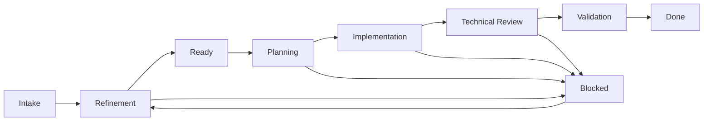

# Agent Team — Tech Lead workspace

> Operational structure of the workspace shared by Tech Lead agents. Complements [human trio operating system](../rules/operating-model.md), [agent catalog](../../../../agents/catalog.md), and [90/10 operating model](../rules/operating-model-90-10.md).
>
> A browsable implementation of this agreement is available at [`workspaces/tech-lead/`](../../README.md).
> Reusable workflows are in the [global catalog](../workflows/README.md); This workspace maintains only your local bindings and execution artifacts per project.

## 1. Objective

Organize the context, planning, execution and learning of all projects under the responsibility of the Tech Lead in a single workspace, shared by its agents.

The model explicitly separates:

- global knowledge, valid for several projects;
- source of truth for each project;
- source code and checkouts from GitHub repositories;
- coordination of work between agents;
- working memory;
- learning still candidates and knowledge already validated.

The central principle is: **the project is the main unit of organization of the work, while the repository is the unit of organization of the code**. A project can involve multiple repositories and a repository can serve more than one project.

## 2. Recommended structure

```text
tech-lead/
├── AGENTS.md
├── WORKSPACE.md
├──BOARD.md
│
├── docs/
│ ├── portfolio/
│ │ └── PROJECTS.md
│ ├── standards/
│ │ ├── architecture.md
│ │ ├── coding.md
│ │ ├── testing.md
│ │ └── security.md
│ ├── playbooks/
│ │ ├── create-project.md
│ │ ├── incident-response.md
│ │ ├── release.md
│ │ └── technical-discovery.md
│ ├── workflows/
│ │ └── README.md # local bindings for canonical workflows
│ └── templates/
│ ├── adr.md
│ ├── plan.md
│ ├── spec.md
│ ├── work-item.md
│ └── handoff.md
│
├── projects/
│ ├── README.md
│ └── <project-slug>/
│ ├── README.md
│ ├── CONTEXT.md
│ ├── STATUS.md
│ │
│ ├── product/
│ │ ├── prd/
│ │ ├── requirements/
│ │ └── glossary.md
│ │
│ ├── ux/
│ │ ├── research/
│ │ ├── flows/
│ │ └── handoffs/
│ │
│ ├── engineering/
│ │ ├── architecture/
│ │ ├── adr/
│ │ ├── specs/
│ │ ├── api/
│ │ ├── diagrams/
│ │ └── repositories.yaml
│ │
│ ├── plans/
│ │ ├── active/
│ │ ├── archive/
│ │ └── assets/
│ │ └── <workflow>/
│ │ └── <data>-<session-id>/
│ │
│ ├── work-items/
│ │ ├── WI-001.md
│ │ ├── WI-002.md
│ │ └── README.md
│ │
│ ├── execution/
│ │ ├── handoffs/
│ │ ├── reviews/
│ │ └── evidence/
│ │
│ ├── LEARNINGS.md
│ │ ├── candidates/
│ │ └── accepted/
│ │
│ └── memory/
│ ├── current-state.md
│ ├── decisions-summary.md
│ └── history/
│
├── repos/
│ ├── README.md
│ ├── registry.yaml
│ ├── github/
│ │ └── <organization>/
│ │ └── <repository>/
│ └── worktrees/
│ └── <organization>/
│ └── <repository>/
│ └── <work-item>/
│
├── .coordination/
│ ├── active/
│ ├── handoffs/
│ ├── blockers/
│ └── inbox/
│
├── memory/
│ ├── workspace.md
│ ├── agents/
│ └── history/
│
└──archive/
```

## 3. Responsibility of each area

### 3.1 `docs/` — global knowledge

Stores only content applicable to multiple projects:

- architecture, code, testing and security standards;
- operational playbooks;
- local bindings for [canonical workflows](../workflows/README.md), with authorized version, permissions and integrations;
- templates;
- portfolio view.

PRDs, specs and specific decisions should not be duplicated here. They belong to the corresponding project.

The `docs/workflows/` directory does not store execution output. `PLAN.md`, `SPEC.md`, `ADR.md`, Work Items, reviews, evidence packs and persistent handoffs belong to `projects/<project>/`; `coordination/` is only for transient communication between agents.

### 3.2 `projects/<project-slug>/` — project source of truth

Centralizes all project-specific material:

- context and status;
- PRDs and requirements;
- UX research and specifications;
- architecture, ADRs, APIs and technical specs;
- active and archived plans;
- work items;
- handoffs, reviews and evidence;
- learning and working memory of the project.

An agent should be able to go into this folder and find the necessary context without searching the entire workspace.

### 3.3 `repos/` — source code from GitHub repositories

Contains the local clones of the repositories used by the agents. The recommended organization preserves GitHub's identity:

```text
repos/github/<organization>/<repository>/
```

Example:

```text
repos/github/acme/checkout-api/
repos/github/acme/checkout-web/
repos/github/acme/design-system/
```

The `repos/` directory does not replace `projects/`:

| Concept | Responsibility |
|---|---|
| `projects/` | Why, what and when will it be built |
| `repos/` | Where the code is implemented and versioned |
| GitHub | Official remote, collaboration, PRs, checks and releases |

There must be no duplicate clones within each project. The binding is declared in `projects/<project>/engineering/repositories.yaml`.

Example:

```yaml
project: checkout
repositories:
  - id: checkout-api
    github: acme/checkout-api
    local_path: repos/github/acme/checkout-api
    role: backend
    required: true
  - id: checkout-web
    github: acme/checkout-web
    local_path: repos/github/acme/checkout-web
    role: frontend
    required: true
  - id: design-system
    github: acme/design-system
    local_path: repos/github/acme/design-system
    role: shared-library
    required: false
```

#### Global repository registry

`repos/registry.yaml` is the operational inventory of available clones:

```yaml
repositories:
  - id: checkout-api
    github: acme/checkout-api
    local_path: repos/github/acme/checkout-api
    default_branch: main
    kind: service
    projects:
      - checkout
    owner: payments-team
    status: active
```

This record should store metadata and relationships, not volatile information like the current SHA or whether the checkout is clean. Git status must be queried directly in the repository.

#### Worktrees for competing agents

The clone in `repos/github/` is the local canonical copy. When more than one agent needs to act on the same repository, each mission must use an isolated worktree:

```text
repos/worktrees/<organization>/<repository>/<work-item>/
```

Example:

```text
repos/worktrees/acme/checkout-api/WI-031/
repos/worktrees/acme/checkout-api/WI-044/
```

The Work Item must register `repository`, `worktree`, `branch` and `base_branch`. Terminated worktrees should be removed only after confirming that commits and evidence have been preserved.

#### Storage and indexing precautions

- `repos/` must remain on a trusted local disk; avoid synchronized folders that may corrupt or degrade `.git`;
- exclude `.git/`, `node_modules/`, build artifacts, caches and document indexing dependencies;
- do not copy secrets, `.env` files or credentials for documentation, memory or handoffs;
- each repository maintains its own `AGENTS.md`, README, build rules and local instructions;
- `repos/README.md` explains how to clone, update, create worktrees and validate the repositories of this workspace.

### 3.4 `plans/` — planning within the project

Global plans quickly lose connection to context, execution, and evidence. Therefore, each project has:

- `active/`: plans in preparation or execution;
- `archive/`: plans completed, canceled or replaced;
- `assets/`: raw material that supports workflow analysis and discussions — transcriptions, printscreens, e-mails, PDFs, Word documents and the like.

Every plan must declare project, status, responsible and related Work Items.

#### `plans/assets/` — isolated raw material per session

Each execution of a workflow (intake, discovery, technical specification, etc.) saves its raw material in its own folder, so that a new attempt never collides with the previous one:

```text
plans/assets/<workflow>/<YYYY-MM-DD>-<session-id>/
```

- `<workflow>` identifies the workflow or skill that generated the material, for example `01-discovery-and-research` or `technical-discovery`.
- `<session-id>` is a short and unique run identifier (`mission_id` or run id). Re-executing a workflow due to unsatisfactory results creates a new folder; the previous one remains in the history, but is no longer referenced.
- Within the session folder, use subfolders by type only when there is more than one file of the same type: `transcripts/`, `screenshots/`, `emails/`, `documents/`.
- `plans/assets/` is never canonical source. The conclusion, decision or requirement extracted from the material goes to the correct domain artifact (`product/`, `ux/`, `engineering/` or the plan); the asset remains as an auditable trail, referenced by path.
- `STATUS.md` or the corresponding Work Item must indicate which session of `plans/assets/` supports the current version of an artifact when this is not obvious.

```yaml
---
id: PLAN-014
project: checkout
status: active
owner: tech-lead
work_items:
  - WI-031
  - WI-032
updated_at: 2026-08-08
---
```

### 3.5 `memory/` — operational memory

Memory helps agents continue an execution. May contain:

- observed state;
- session summaries;
- temporary context;
- useful commands;
- pointers to official documents.

Memory is not a source of truth. When information becomes durable, it must be promoted:

| Information | Official destination |
|---|---|
| Technical decision | ADR |
| Requirement | PRD or spec |
| Work needed | Work Item |
| Evidence of execution | `execution/evidence/` |
| Validated learning | `LEARNINGS.md (aceitos)` or `docs/` |

Root memory contains only workspace information. Specific memory remains within the project.

### 3.6 `LEARNINGS.md` — curated learning

It has two stages:

- `candidates/`: observations not yet confirmed;
- `accepted/`: validated and reusable learning in the project.

When a learning becomes effective for multiple projects, it should be promoted to `docs/standards/` or `docs/playbooks/`.

### 3.7 `coordination/` — communication between agents

It only stores transversal and temporary coordination:

- `active/`: missions in progress and those responsible;
- `handoffs/`: explicit context passing between agents;
- `blockers/`: impediments that require external resolution;
- `inbox/`: entries not yet screened.

Upon completion, durable content must be incorporated into the project and transitional material can be archived.

## 4. BOARD and Work Items

`BOARD.md` should not be the primary database. Multiple agents editing the same file increases the risk of conflict and overwriting.

The source of truth is one file per Work Item:

```text
projects/checkout/work-items/WI-031.md
```

### 4.1 Work Item Model

```markdown
---
id: WI-031
title: Implement idempotence in payment processing
project: checkout
status: implementation
priority: high
owner: agent-backend
reviewer: tech-lead
repositories:
  - id: checkout-api
    branch: feat/WI-031-payment-idempotency
    base_branch: main
    worktree: repos/worktrees/acme/checkout-api/WI-031
depends_on:
  - WI-027
blocked_by: []
updated_at: 2026-08-08T14:30:00-03:00
---

## Objective

Prevent duplicate processing of payment events.

## Acceptance criteria

- [ ] Repeated events do not generate new charges
- [ ] State remains consistent after retry
- [ ] Tests cover competition and redelivery

## Related plan

`PLAN-014`

## Evidence

Fill in during implementation.

## History

- 2026-08-08: item refined by architecture agent.
```

### 4.2 Role of `BOARD.md`

The root board offers a consolidated view of the portfolio:

```markdown
#Board

## Backlog

- `WI-045` — checkout

## Refinement

- `WI-018` — identity

## Ready

- `WI-031` — checkout

## Implementation

- `WI-009` — catalog

##Blocked

- `WI-014` — identity — awaiting security decision

##Review

- `WI-028` — checkout

##Done

- `WI-007` — catalog
```

Ideally, this file should be regenerable from the Work Items field `status`. To reduce contention, agents update their own Work Items; a coordinating agent updates or regenerates the board.

## 5. Multi-agent workflow



### 5.1 Stage exit contract

| Step | Exit condition |
|---|---|
| Intake | Work Item created and associated with a project |
| Refinement | Scope, acceptance criteria, risk and dependencies defined |
| Ready | No doubt or relevant block to start |
| Planning | Technical plan and division of labor registered |
| Implementation | Artifacts produced and evidence collected |
| Technical Review | Technical review registered and pending issues resolved |
| Validation | Proven acceptance criteria |
| Done | Result delivered and documentation updated |

`Blocked` is not a normal step: it is an exception state. Every blockage must inform the cause, impact, person responsible for the resolution and next action.

## 6. Fundamental files

### 6.1 `WORKSPACE.md`

It's the gateway. It should explain:

- how to navigate the workspace;
- what are the active projects;
- where each type of information belongs;
- how to start and complete a mission;
- which documents are sources of truth.

### 6.2 `AGENTS.md`

Defines mandatory rules for all agents:

1. Read `WORKSPACE.md` and the applicable `AGENTS.md`.
2. Read `CONTEXT.md` and `STATUS.md` before working on a project.
3. Query `engineering/repositories.yaml` to find the repositories involved.
4. Read `AGENTS.md` and local instructions for each repository before changing code.
5. Create or assume a Work Item before modifying artifacts.
6. Declare repository, branch, worktree and scope of change.
7. Check Git status and preserve pre-existing changes.
8. Do not overwrite another agent's work.
9. Record decisions, validations and evidence.
10. Produce explicit handoff when changing agents.
11. Do not transform temporary memory into a source of truth.
12. Do not mark an item as completed without checking the acceptance criteria.

### 6.3 `projects/<project>/CONTEXT.md`

Explains the project in a relatively stable way:

- problem and objective;
- users and stakeholders;
- scope limits;
- current architecture;
- related systems and repositories;
- glossary and relevant restrictions.

### 6.4 `projects/<project>/STATUS.md`

It is a short and current executive summary:

```markdown
# Status

- Phase: implementation
- Current goal: make payments idempotent
- Active plan: `PLAN-014`
- Running items: `WI-031`, `WI-032`
- Blocks: definition of the retention period
- Last updated: 2026-08-08
```

## 7. Source of truth rules

| Subject | Source of truth |
|---|---|
| Priority between projects | `BOARD.md` and `docs/portfolio/PROJECTS.md` |
| Context of a project | `projects/<project>/CONTEXT.md` |
| Current status of the project | `projects/<project>/STATUS.md` |
| Product Requirement | `product/prd/` or `product/requirements/` |
| User Experience | `ux/` |
| Architectural decision | `engineering/adr/` |
| Technical specification | `engineering/specs/` |
| Relationship between project and repositories | `projects/<project>/engineering/repositories.yaml` |
| Inventory of local clones | `repos/registry.yaml` |
| Source code and checkout status | repository on `repos/github/` or active worktree |
| Remote, PRs, checks and releases | GitHub |
| Execution strategy | `plans/active/` |
| Raw material from a workflow session | `plans/assets/<workflow>/<data>-<session-id>/` (non-authoritative) |
| Status of a work unit | file in `work-items/` |
| Completion test | `execution/evidence/` |
| Agent Temporary Context | `memory/` |

Information should not exist as authoritative content in two places. Summary files must point to the original source.

## 8. Operating conventions

### 8.1 Identifiers

- project: stable slug, for example `checkout`;
- plan: `PLAN-NNN`;
- Work Item: `WI-NNN`;
- ADR: `ADR-NNN`;
- handoff: `HANDOFF-<work-item>-<origem>-<destino>.md`.

When identifiers may collide between projects, use the project prefix, such as `CHK-WI-031`.

### 8.2 Allowed states

```text
backlog
refinement
ready
planning
implementation
review
validation
blocked
done
cancelled
```

Values ​​must be stable and always written in the same way to allow automation.

### 8.3 Minimum handoff

Every handoff must record:

- mission and Work Item;
- repositories, branches, worktrees and commits involved;
- what was done;
- changed files;
- decisions made;
- available evidence;
- pending issues and risks;
- next expected action;
- agent or target role.

### 8.4 Competition between agents

- each active mission has a single responsible agent;
- responsibility and start time are recorded in the Work Item;
- two agents cannot simultaneously edit the same artifact without explicit division;
- competing agents in the same repository use branches and worktrees separated by Work Item;
- pre-existing local changes are never discarded or incorporated without authorization;
- the board is consolidated by a coordinator, not freely edited by everyone;
- transient findings are recorded in separate files, avoiding a large shared file of notes.

## 9. Incremental deployment

### Phase 1 — minimum contract

Create only:

```text
AGENTS.md
WORKSPACE.md
BOARD.md
repos/
├── README.md
├── registry.yaml
└── github/<organization>/<repository>/
projects/<piloto>/
├── README.md
├── CONTEXT.md
├── STATUS.md
├── engineering/repositories.yaml
├── plans/active/
├── work-items/
└── execution/evidence/
```

### Phase 2 — templates and coordination

- add plan, ADR, Work Item and handoff templates;
- enter `.coordination/`;
- standardize metadata and states;
- standardize branches and worktrees by Work Item;
- validate the flow with a real project.

### Phase 3 — memory and learning

- add memory per project;
- create the `candidate -> accepted -> promoted` flow;
- set temporary context retention and archiving.

### Phase 4 — automation

- regenerate `BOARD.md` from Work Items;
- detect items without owner, criteria or evidence;
- validate links and identifiers;
- check divergences between `registry.yaml`, existing projects and clones;
- detect orphaned worktrees and branches without related Work Item;
- generate status and blocking reports;
- warn when memory contains decision not yet promoted.

## 10. Recommended decision

Adopt `projects/<project>/` as the central unit of work, move `plans/` within each project and use `repos/` as the canonical location of code checkouts.

Keep only transverse elements at the root:

- `docs/`: curated global knowledge;
- `repos/`: GitHub repositories and local worktrees;
- `.coordination/`: temporary communication between agents;
- `memory/`: workspace memory;
- `BOARD.md`: consolidated view of the portfolio;
- `archive/`: global material disabled.

This division clearly separates documentation, planning and code; reduces duplicity; improves navigation; limits conflicts between agents; and makes the source of truth of each information explicit.
