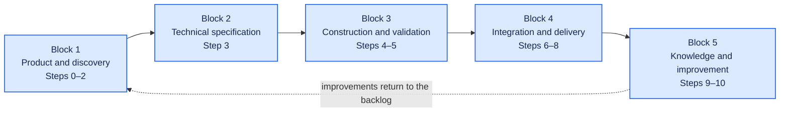
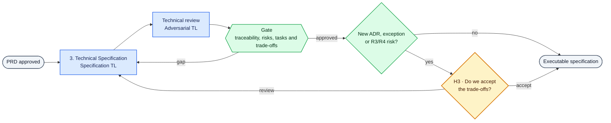
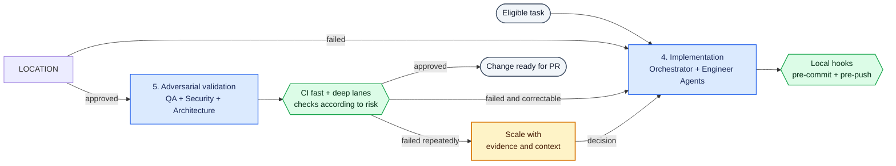
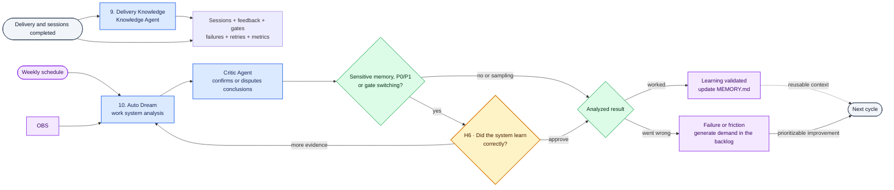

# Agent Team — journey in phases

> Fragmented view of [complete flow](end-to-end-journey.md), designed for analysis in parts and use in slides. The interaction contracts between agents are in [workflow map](../../../../workflows/README.md).

## Block map

---

## Block 1 — product and discovery

### Scope

- Workflows: [intake](../../../../workflows/00-intake-and-triage.md), [discovery and research](../../../../workflows/01-discovery-and-research.md) and [product and UX planning](../../../../workflows/02-product-and-ux-planning.md)
- Step 0: backlog and triage
- Step 1: multi-agent discovery
- Step 2: Product Planning
- Human checkpoints: H1 and H2
- Main artifacts: `PB.md` and `PRD.md`

```mermaid
flowchart LR
    IN([Problem or opportunity])

    S0["0. Backlog and triage<br/>Intake + PM Agents"]
    G0{{"Gate<br/>context, owner, duplicity and risk"}}

    S1["1. Discovery<br/>PM + UX Spec + Tech Lead"]
    G1{{"Gate<br/>problem, user, experience and feasibility"}}
    H1{"H1 · Is it worth investing?"}

    S2["2. Planning<br/>PM + Adversarial PM"]
    G2{{"Gate<br/>clarity, acceptance, scope and metrics"}}
    H2{"H2 · Is this what<br/>we will build?"}

    OUT([PRD approved])

    IN --> S0 --> G0
    G0 -- "incomplete" --> S0
    G0 -- "approved" --> S1 --> G1
    G1 -- "gap" --> S1
    G1 -- "approved" --> H1
    H1 -- "adjust" --> S1
    H1 -- "postpone" --> S0
    H1 -- "forward" --> S2 --> G2
    G2 -- "ambiguity" --> S2
    G2 -- "approved" --> H2
    H2 -- "review" --> S2
    H2 -- "approve" --> OUT

    classDef agent fill:#dbeafe,stroke:#2563eb,color:#172554,stroke-width:1.5px;
    classDef automation fill:#dcfce7,stroke:#16a34a,color:#052e16,stroke-width:1.5px;
    classDef human fill:#fef3c7,stroke:#d97706,color:#451a03,stroke-width:2px;
    classDef terminal fill:#f1f5f9,stroke:#475569,color:#0f172a,stroke-width:1.5px;
    class S0,S1,S2 agent;
    class G0,G1,G2 automation;
    class H1,H2 human;
    class IN,OUT terminal;
```

### Focus of the discussion

- Is the problem clear before discussing the solution?
- Were user, experience and feasibility analyzed together?
- Did the adversarial PM find real ambiguities?
- Did humans decide value and scope, not operational details?

---

## Block 2 — technical specification

### Scope

- Workflow: [technical specification](../../../../workflows/03-technical-specification.md)
- Step 3: specification and technical criticism
- Human checkpoint: conditional H3
- Artifacts: `PLAN.md`, `ADR.md`, `SPEC.md`, `TASKS.md` and `CHECKLIST.md`

### Focus of the discussion

- Does the solution respond to the PRD without expanding the scope?
- Have alternatives and trade-offs been recorded?
- Can tasks be implemented and validated in isolation?
- Is H3 reserved for truly structural or risky decisions?

---

## Block 3 — construction and validation

### Scope

- Workflows: [standalone implementation](../../../../workflows/04-autonomous-implementation.md) and [adversarial validation](../../../../workflows/05-adversarial-validation.md)
- Step 4: Standalone implementation
- Step 5: adversarial validation
- Human intervention only by exception
- Output: change ready for PR

### Focus of the discussion

- Which faults can be automatically corrected?
- Which checks belong to the local hook or the CI?
- Is the deep lane triggered by risk and altered paths?
- Does scheduling deliver an objective decision to the human?

---

## Block 4 — integration and delivery

### Scope

- Workflows: [PR and merge](../../../../workflows/06-pr-and-merge.md), [approval](../../../../workflows/07-release-candidate-validation.md) and [production and observation](../../../../workflows/08-production-release-and-observation.md)
- Step 6: PR and merge decision
- Step 7: automated approval
- Stage 8: production and initial observation
- Human checkpoints: H4 and H5

```mermaid
flowchart LR
    IN([Change validated])
    S6["6. PR + evidence pack<br/>PR + Reviewer Agents"]
    H4{"H4 · Can we integrate?"}
    MERGE["Protected merge<br/>checks + approvals"]
    S7["7. Homologation<br/>preview + E2E + evidence"]
    G7{{"Gate<br/>release candidate approved"}}
    RISK{"Policy requires<br/>production approval?"}
    H5{"H5 · Can we expose<br/>the risk?"}
    S8["8. Production<br/>progressive rollout"]
    HEALTH{{"Post-deploy gate<br/>SLOs + metrics"}}
    BACK["Rollback or<br/>automatic pause"]
    REWORK([Return to step 4])
    OUT([Healthy Delivery])

    IN --> S6 --> H4
    H4 -- "adjust" --> REWORK
    H4 -- "approve" --> MERGE --> S7 --> G7
    G7 -- "failed" --> REWORK
    G7 -- "approved" --> RISK
    RISK -- "no" --> S8
    RISK -- "yes · R3/R4" --> H5
    H5 -- "review" --> S7
    H5 -- "approve" --> S8
    S8 --> HEALTH
    HEALTH -- "regression" --> BACK
    BACK --> REWORK
    HEALTH -- "healthy" --> OUT

    classDef agent fill:#dbeafe,stroke:#2563eb,color:#172554,stroke-width:1.5px;
    classDef automation fill:#dcfce7,stroke:#16a34a,color:#052e16,stroke-width:1.5px;
    classDef human fill:#fef3c7,stroke:#d97706,color:#451a03,stroke-width:2px;
    classDef terminal fill:#f1f5f9,stroke:#475569,color:#0f172a,stroke-width:1.5px;
    classDef failure fill:#fee2e2,stroke:#dc2626,color:#450a0a,stroke-width:1.5px;
    class S6,S7,S8 agent;
    class MERGE,G7,RISK,HEALTH automation;
    class H4,H5 human;
    class IN,REWORK,OUT terminal;
    class BACK failure;
```

### Focus of the discussion

- Does the evidence pack allow review without reading the entire diff?
- Does H4 vary correctly depending on the risk class?
- Does the approval prove acceptance criteria?
- Were deployment and rollback automated before reducing H5?

---

## Block 5 — knowledge and continuous improvement

### Scope

- Workflows: [knowledge curation](../../../../workflows/09-knowledge-curation.md) and [telemetry and continuous improvement](../../../../workflows/10-continuous-improvement.md)
- Step 9: specific knowledge of the delivery
- Step 10: Weekly Auto Dream
- Human checkpoint: H6 conditional or by sampling
- Outputs: `MEMORY.md` and improvement demands

### Focus of the discussion

- Does the learning have evidence and context of application?
- Is Critic Agent independent of who generated the conclusion?
- Recurring problems become actionable demands?
- H6 only protects sensitive changes without becoming a bottleneck?
- Do improvements effectively return to the backlog?

---

## Common caption

- **Blue:** Agent Teams and specialized agents
- **Green:** automations, gates, hooks and policy decisions
- **Yellow:** human decision or intervention
- **Purple:** knowledge, telemetry and continuous improvement
- **Red:** recovery or rollback
- **Gray:** block entry or exit

## Suggested use

- Use the block map to present the complete journey
- Use one block per slide when detailing
- Discuss human goals and decisions first
- Then detail agents, automations and gates
- Keep the numbering aligned with the complete flow
