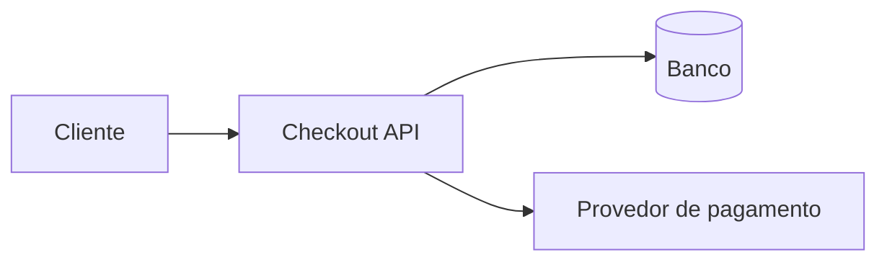

# Current state of the architecture

`checkout-api` exposes payment creation, persists its state, and calls an external provider. Idempotence will be enforced at the application boundary and guaranteed by a unique constraint on storage.

The diagram records the topology, not the operational state of local checkouts.
